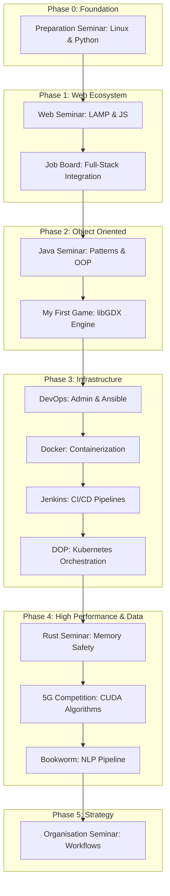

<!-- markdownlint-disable MD033 -->
<div align="center">
  
  <br />
  
  
  
</div>
<!-- markdownlint-enable MD033 -->

## Overview

This repository serves as a professional portfolio for all technical seminars and high-stakes projects (Days 01-95). It is structured to provide both a horizontal view of the curriculum and a vertical deep-dive into the technical implementation of every daily challenge.

### Project Structure

```text
piscine/
├── seminar-preparation/     # Days 01-10 : Linux, Python, algorithms
├── seminar-web/             # Days 11-20 : HTML, CSS, JavaScript, PHP
├── seminar-job-board/       # Days 21-30 : Full-stack project
├── seminar-java/            # Days 31-40 : OOP, generics, design patterns
├── seminar-my-first-game/   # Days 41-55 : 2D game development (libGDX)
├── seminar-devops/          # Days 56-60 : Administration, virtualization, automation
├── seminar-docker/          # Days 61-65 : Containerization, orchestration, microservices
├── seminar-jenkins/         # Days 66-70 : Jenkins, CI/CD, Configuration as Code
├── seminar-rust/            # Days 71-95 : Rust, memory safety, ownership, full-stack
├── seminar-organisation/    # Days 96-120 : Organizational theory & strategy
├── seminar-project-management/ # T-CEN-500 : Project management
├── seminar-dop/             # Kubernetes : multi-service orchestration (Bernstein)
├── seminar-ai/              # NLP : book analysis pipeline (Bookworm)
└── competition/                # 5G antenna optimization competition
```

---

## Technical Core

| Domain | Implementation |
|---|---|
| **System & Logic** |    |
| **Web & API** |    |
| **Infra & DevOps** |    |
| **Data & Storage** |    |

---

## Repository Pulse

Line-by-line breakdown of the multi-stack ecosystem (code only, excluding blank/comment lines and external dependencies). Generated with [cloc](https://github.com/AlDanial/cloc) via **nix-shell** (June 2026):

| Language     | Files | Lines (code) | Weight |
|--------------|-------|--------------|--------|
| **JavaScript** | 249  | 295,862      | 32%    |
| **Java**     | 205   | 9,291        | 1%     |
| **Rust**     | 85    | 6,105        | 1%     |
| **HTML**     | 194   | 30,861       | 3%     |
| **CSS**      | 22    | 4,657        | 1%     |
| **Python**   | 112   | 1,833        | <1%    |
| **JSON**     | 61    | 14,944       | 2%     |
| **Markdown** | 118   | 5,309        | <1%    |
| **YAML**     | 33    | 1,108        | <1%    |
| **PHP**      | 27    | 507          | <1%    |
| **XML**      | 6     | 587          | <1%    |
| **Groovy**   | 2     | 74           | <1%    |
| **Total**    | **1,119** | **913,503** | **100%** |

> **Note**: SQL data (542K lines in 5 files) excluded from table — primarily corpus/reference data. Total includes all tracked files.

---

## Seminars Detail

### [Preparation Seminar — Days 01-10](seminar-preparation/README.md)
Linux fundamentals, Python scripting, and introductory graphics development with **Turtle** and **Pygame**.

    

### [Web Seminar — Days 11-20](seminar-web/README.md)
Semantic HTML5/CSS, client-side JavaScript, and PHP integration.

     

### [Job Board Seminar — Days 21-30](seminar-job-board/README.md)
Full-stack recruitment platform with REST API and database integration.

    

### [Java Seminar — Days 31-40](seminar-java/README.md)
Object-oriented mastery: generics, reflection, and fundamental design patterns.

     

### [My First Game Seminar — Days 41-55](seminar-my-first-game/README.md)
2D game development using libGDX, adhering to SOLID principles and modular architecture.

    

### [DevOps Seminar — Days 56-60](seminar-devops/README.md)
Linux administration, advanced networking, system security, and Ansible automation.

     

### [Docker Seminar — Days 61-65](seminar-docker/README.md)
Containerization and microservices orchestration with Docker Compose.

     

### [Jenkins Seminar — Days 66-70](seminar-jenkins/README.md)
Continuous Integration with Jenkins and Configuration as Code pipelines.

    

### [Rust Seminar — Days 71-95](seminar-rust/README.md)
Memory-safe systems programming and Discord-like real-time messaging.

        

### [Organisation Seminar — Days 96-120](seminar-organisation/README.md)
Organizational theory, workflow optimization, and strategic agency management.

   

### [Project Management Seminar — SmartFridge (T‑CEN‑500)](seminar-project-management/README.md)
Holistic project management around the SmartFridge product: Gantt planning, budget, resources, and risk communication.

  

### [DOP — Bernstein : Kubernetes Orchestration](seminar-dop/README.md)
Distributed voting application orchestrated on a multi-node Kubernetes cluster: Flask front-end, Redis queue, Java worker, PostgreSQL store and a Node.js dashboard, fronted by Traefik. Infrastructure provisioned on DigitalOcean (DOKS) via Terraform, reproducible dev environment with Nix.

       

### [AI — Bookworm : NLP Pipeline](seminar-ai/README.md)
Advanced NLP pipeline for book analysis: lexical diversity, topic extraction, entity detection, summarization and similarity, built on a reusable bootstrap foundation with a canonical CLI entrypoint.

   

### [Code Competition — 5G or not 5G?](competition/README.md)
Algorithmic optimization for 5G antenna network deployment using CUDA.

    

---

## Curriculum Roadmap



---

## Chronological Roadmap

```
PHASE 0: Foundation (Days 1-10)
├─ Preparation: Linux & Python
│
PHASE 1: Web Ecosystem (Days 11-30)
├─ Web: HTML, CSS, JavaScript, PHP
├─ Job Board: Full-stack integration
│
PHASE 2: Object-Oriented (Days 31-55)
├─ Java: Patterns & OOP
├─ My First Game: libGDX Engine
│
PHASE 3: Infrastructure & Automation (Days 56-70)
├─ DevOps: Linux admin, Ansible, virtualization
├─ Docker: Containerization & microservices
├─ Jenkins: CI/CD & Configuration as Code
│
PHASE 4: High-Performance & Advanced (Days 71-135)
├─ Rust: Memory safety & full-stack (Days 71-95, **25 days**) ─────────┐
├─ Organisation: Strategic planning (Days 96-120, **25 days**) ────────┤ Sequential
│  ├─ Sprint 1: Company audits                                         │
│  ├─ Sprint 2: Comparative analysis                                   │
│  └─ Sprint 3: Target modeling                                        │
├─ DOP: Kubernetes orchestration (Days 121-135, **15 days**) ─────────┘
│  └─ Concurrent │
│  │             ├─ Bernstein: Distributed voting on K8s
├─ AI: NLP pipeline (Days 121-135, **15 days**) ──────────────────────┘
│  ├─ Bookworm: Book analysis engine
│
SPECIAL TRACKS:
├─ Project Management: SmartFridge (T-CEN-500, parallel)
├─ 5G Competition: CUDA algorithm optimization
```

### Timeline Summary

| Phase | Days | Duration | Focus |
|-------|------|----------|-------|
| **Foundation** | 1–10 | 2 wks | Linux, Python, algorithms |
| **Web** | 11–30 | 3 wks | Web stack (LAMP + JS) |
| **Java/Game** | 31–55 | 5 wks | OOP, design patterns |
| **DevOps** | 56–70 | 3 wks | Sys admin, Docker, Jenkins |
| **Rust** | 71–95 | 5 wks | Memory safety, full-stack |
| **Organisation** | 96–120 | 5 wks | Strategic management |
| **DOP + AI** | 121–135 | 3 wks | (Concurrent) K8s + NLP |
