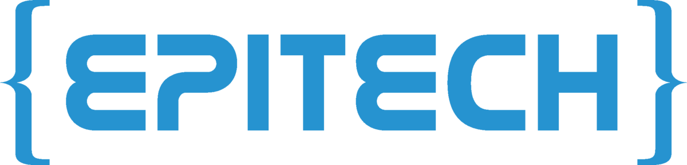
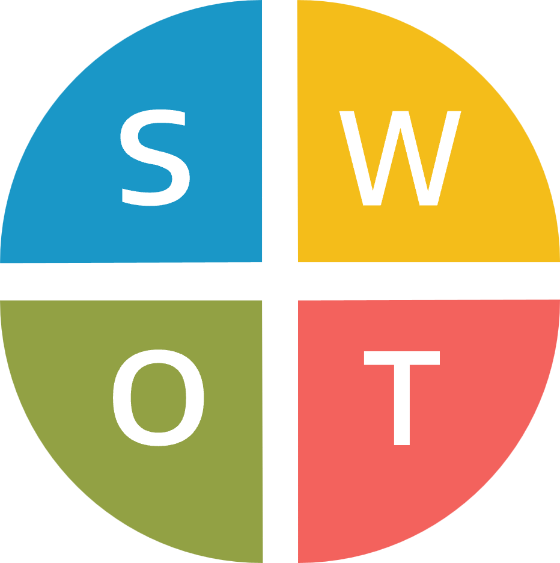
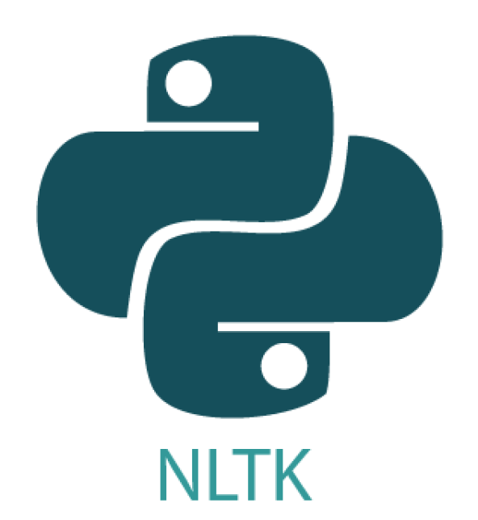

<!-- markdownlint-disable MD033 -->
<div align="center">
  
</div>
<p align="left">
  
  
  
  
  
  
  
  
  
  
  
  
  
  
  
  
  
  
  
  
  
  
  
</p>
<!-- markdownlint-enable MD033 -->

## Overview

This repository serves as a professional portfolio for all technical seminars and high-stakes projects across Days 01-135, including overlapping tracks in the final phase. It is structured to provide both a horizontal view of the curriculum and a vertical deep-dive into the technical implementation of every daily challenge.

## Installation

Clone this repository using either HTTP or SSH:

### Via HTTPS

```bash
git clone https://github.com/RomeoCavazza/piscine-epitech.git
cd piscine-epitech
```

### Via SSH

```bash
git clone git@github.com:RomeoCavazza/piscine-epitech.git
cd piscine-epitech
```

### Project Structure

```text
piscine/
├── seminar-preparation/        # Days 01-10
├── seminar-web/                # Days 11-20
├── seminar-job-board/          # Days 21-30
├── seminar-java/               # Days 31-40
├── seminar-my-first-game/      # Days 41-55
├── seminar-devops/             # Days 56-60
├── seminar-docker/             # Days 61-65
├── seminar-jenkins/            # Days 66-70
├── seminar-rust/               # Days 71-95
├── seminar-organisation/       # Days 96-120
├── seminar-project-management/ # Parallel track (T-CEN-500)
├── seminar-dop/                # Days 121-135
├── seminar-ai/                 # Days 121-135
└── competition/                # Parallel track (5G)
```

## Curriculum Roadmap

```mermaid
graph LR
    subgraph Prepare[Phase 0: Foundation]
        S1[Preparation Seminar: Linux & Python]
    end
    subgraph Web[Phase 1: Web Ecosystem]
        S2[Web Seminar: LAMP & JS]
        S3[Job Board: Full-Stack Integration]
    end
    subgraph Java[Phase 2: Object Oriented]
        S4[Java Seminar: Patterns & OOP]
        S5[My First Game: libGDX Engine]
    end
    subgraph Ops[Phase 3: Infrastructure]
        S6[DevOps: Admin & Ansible]
        S7[Docker: Containerization]
        S8[Jenkins: CI/CD Pipelines]
        S12[DOP: Kubernetes Orchestration]
    end
    subgraph System[Phase 4: High Performance & Data]
        S9[Rust Seminar: Memory Safety]
        S10[5G Competition: CUDA Algorithms]
        S13[Bookworm: NLP Pipeline]
    end
    subgraph Management[Phase 5: Strategy]
        S11[Organisation Seminar: Workflows]
    end

    S1 --> S2 --> S3 --> S4 --> S5 --> S6 --> S7 --> S8 --> S12 --> S9 --> S10 --> S13 --> S11
```



## Seminars Detail

### [Preparation Seminar - Days 01-10](seminar-preparation/)
    

Foundation seminar covering the Linux command line, shell habits, Python scripting and first graphical exercises, with a progression from system basics to small interactive programs built with Turtle and Pygame.

[Repo](seminar-preparation/) | [README](seminar-preparation/README.md)

### [Web Seminar - Days 11-20](seminar-web/)
     

Front-end and web integration seminar focused on semantic HTML5, responsive CSS, client-side JavaScript and first PHP back-end bridges, with forms, DOM interactions and structured data flowing into a classic web stack.

[Repo](seminar-web/) | [README](seminar-web/README.md)

### [Job Board Seminar - Days 21-30](seminar-job-board/)
    

Full-stack recruitment platform combining PHP back-end logic, relational data modeling, REST-style exchanges and browser-side interactions, built to connect job listings, candidates and administration workflows in one coherent product.

[Repo](seminar-job-board/) | [README](seminar-job-board/README.md)

### [Java Seminar - Days 31-40](seminar-java/)
     

Object-oriented Java seminar centered on clean architecture, generics, reflection and core design patterns, with a strong emphasis on reusable abstractions, testing discipline and tooling through Maven and JUnit.

[Repo](seminar-java/) | [README](seminar-java/README.md)

### [My First Game Seminar - Days 41-55](seminar-my-first-game/)
    

2D game development track built with libGDX, where gameplay systems, rendering, input handling and asset management are organized through SOLID principles, modular architecture and test-aware engineering practices.

[Repo](seminar-my-first-game/) | [README](seminar-my-first-game/README.md)

### [DevOps Seminar - Days 56-60](seminar-devops/)
     

Systems administration seminar covering Debian server setup, virtual machines, networking services, security hardening and operational automation, with Ansible used to turn repeated infrastructure tasks into reproducible configuration.

[Repo](seminar-devops/) | [README](seminar-devops/README.md)

### [Docker Seminar - Days 61-65](seminar-docker/)
     

Containerization seminar focused on Docker images, service isolation and multi-container orchestration with Docker Compose, culminating in a distributed microservices application wired through databases, queues and network tiers.

[Repo](seminar-docker/) | [README](seminar-docker/README.md)

### [Jenkins Seminar - Days 66-70](seminar-jenkins/)
    

Continuous integration seminar centered on Jenkins, pipeline design and configuration as code, with automated build flows, repository hooks and repeatable CI behavior treated as part of the delivery architecture.

[Repo](seminar-jenkins/) | [README](seminar-jenkins/README.md)

### [Rust Seminar - Days 71-95](seminar-rust/)
        

Systems programming seminar exploring Rust ownership, memory safety and zero-cost abstractions through increasingly ambitious projects, ending in a real-time messaging platform backed by modern web, desktop and database tooling.

[Repo](seminar-rust/) | [README](seminar-rust/README.md)

### [Organisation Seminar - Days 96-120](seminar-organisation/)
   

Organization and strategy seminar dedicated to team structures, workflow analysis and target operating models, with sprint reasoning, comparative diagnostics and management artifacts used to formalize how work should flow inside an agency.

[Repo](seminar-organisation/) | [README](seminar-organisation/README.md)

### [Project Management Seminar - SmartFridge (T-CEN-500)](seminar-project-management/)
  

Holistic project management track built around the SmartFridge case study, combining planning, budgeting, staffing, scheduling and risk communication into a full delivery narrative supported by roadmap and governance artifacts.

[Repo](seminar-project-management/) | [README](seminar-project-management/README.md)

### [DOP Seminar - Days 121-135](seminar-dop/)
       

Distributed voting application orchestrated on a multi-node Kubernetes cluster: Flask front-end, Redis queue, Java worker, PostgreSQL store and a Node.js dashboard, fronted by Traefik. Infrastructure provisioned on DigitalOcean (DOKS) via Terraform, reproducible dev environment with Nix.

[Repo](seminar-dop/) | [README](seminar-dop/README.md)

### [AI Seminar - Days 121-135](seminar-ai/)
   

Advanced NLP pipeline for book analysis: lexical diversity, topic extraction, entity detection, summarization and similarity, built on a reusable bootstrap foundation with a canonical CLI entrypoint.

[Repo](seminar-ai/) | [README](seminar-ai/README.md)

### [Code Competition - 5G or not 5G?](competition/README.md)
    

Optimization competition focused on large-scale 5G antenna placement, combining numerical experimentation, spatial reasoning and CUDA-accelerated computation to improve coverage quality under algorithmic and performance constraints.

[Repo](competition/) | [README](competition/README.md)

---

## Repository Pulse

Line-by-line breakdown of the multi-stack ecosystem (code only, excluding blank/comment lines and external dependencies). Generated with [cloc](https://github.com/AlDanial/cloc) via **nix-shell** (June 2026):

| Language     | Files | Lines (code) | Weight |
|--------------|-------|--------------|--------|
| **JavaScript** | 249  | 295,862      | 32%    |
| **Java**     | 205   | 9,291        | 1%     |
| **Rust**     | 85    | 6,105        | 1%     |
| **HTML**     | 194   | 30,861       | 3%     |
| **CSS**      | 22    | 4,657        | 1%     |
| **Python**   | 112   | 1,833        | <1%    |
| **JSON**     | 61    | 14,944       | 2%     |
| **Markdown** | 118   | 5,309        | <1%    |
| **YAML**     | 33    | 1,108        | <1%    |
| **PHP**      | 27    | 507          | <1%    |
| **XML**      | 6     | 587          | <1%    |
| **Groovy**   | 2     | 74           | <1%    |
| **Total**    | **1,119** | **913,503** | **100%** |

> **Note**: SQL data (542K lines in 5 files) excluded from table — primarily corpus/reference data. Total includes all tracked files.
