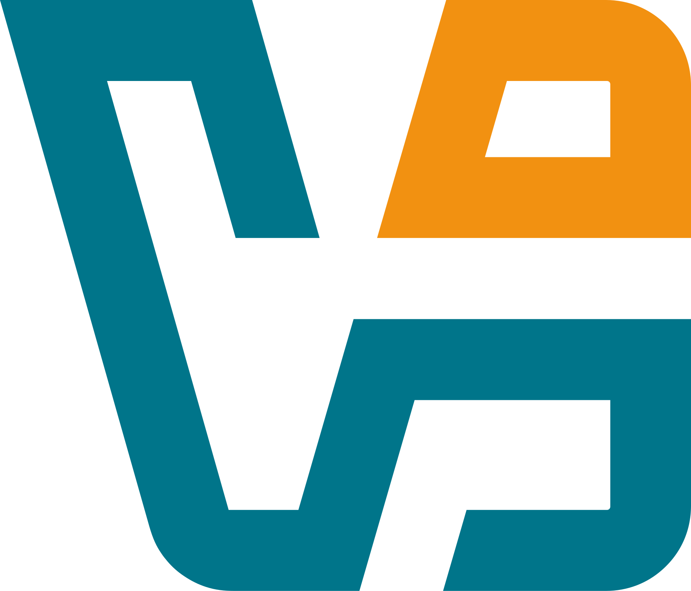
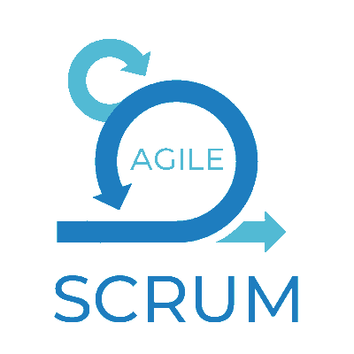
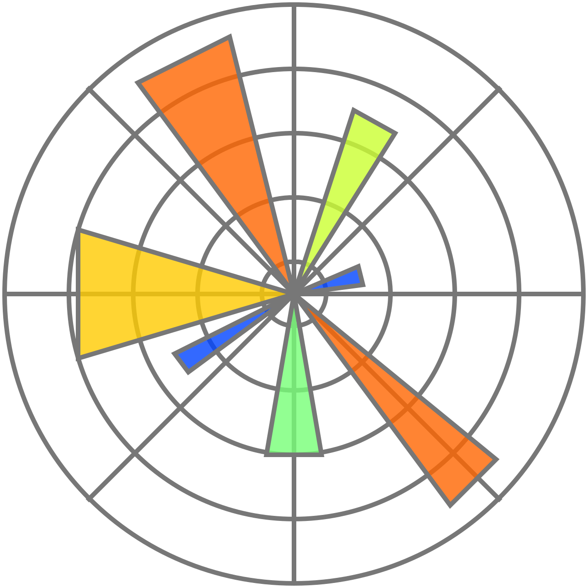
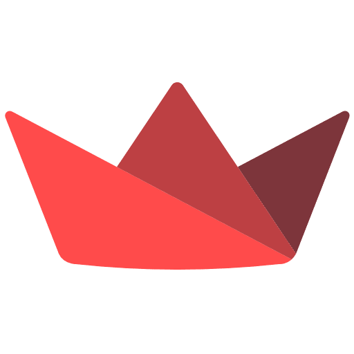

<!-- markdownlint-disable MD033 -->
<div align="center">
  
</div>
<!-- markdownlint-enable MD033 -->


## Overview

This repository serves as a professional portfolio for all technical seminars and high-stakes projects across Days 01-135, including overlapping tracks in the final phase. It is structured to provide both a horizontal view of the curriculum and a vertical deep-dive into the technical implementation of every daily challenge.

## Installation

Clone this repository using either HTTP or SSH:

### Via HTTPS

```bash
git clone https://github.com/RomeoCavazza/piscine-epitech.git
cd piscine-epitech
```

### Via SSH

```bash
git clone git@github.com:RomeoCavazza/piscine-epitech.git
cd piscine-epitech
```

### Project Structure

```text
piscine/
├── seminar-preparation/        # Days 01-10
├── seminar-web/                # Days 11-20
├── seminar-job-board/          # Days 21-30
├── seminar-java/               # Days 31-40
├── seminar-my-first-game/      # Days 41-55
├── seminar-devops/             # Days 56-60
├── seminar-docker/             # Days 61-65
├── seminar-jenkins/            # Days 66-70
├── seminar-rust/               # Days 71-95
├── seminar-organisation/       # Days 96-120
├── seminar-project-management/ # Parallel track (T-CEN-500)
├── seminar-dop/                # Days 121-135
├── seminar-ai/                 # Days 121-135
├── seminar-vigil/              # Parallel track (Security)
└── competition/                # Parallel track (5G)
```

## Curriculum Roadmap

```mermaid
graph LR
    subgraph Prepare[Phase 0: Foundation]
        S1[Preparation Seminar: Linux & Python]
    end
    subgraph Web[Phase 1: Web Ecosystem]
        S2[Web Seminar: LAMP & JS]
        S3[Job Board: Full-Stack Integration]
    end
    subgraph Java[Phase 2: Object Oriented]
        S4[Java Seminar: Patterns & OOP]
        S5[My First Game: libGDX Engine]
    end
    subgraph Ops[Phase 3: Infrastructure]
        S6[DevOps: Admin & Ansible]
        S7[Docker: Containerization]
        S8[Jenkins: CI/CD Pipelines]
        S12[DOP: Kubernetes Orchestration]
    end
    subgraph System[Phase 4: High Performance & Data]
        S9[Rust Seminar: Memory Safety]
        S10[5G Competition: CUDA Algorithms]
        S13[Bookworm: NLP Pipeline]
    end
    subgraph Management[Phase 5: Strategy]
        S11[Organisation Seminar: Workflows]
    end

    S1 --> S2 --> S3 --> S4 --> S5 --> S6 --> S7 --> S8 --> S12 --> S9 --> S10 --> S13 --> S11
```



## Seminars Detail

### [Preparation Seminar - Days 01-10](seminar-preparation/)
       

Foundation seminar covering the Linux command line, shell habits, Python scripting and first graphical exercises, with a progression from system basics to small interactive programs built with Turtle and Pygame.

- [Repo](seminar-preparation/)
- [README](seminar-preparation/README.md)

### [Web Seminar - Days 11-20](seminar-web/)
       

Front-end and web integration seminar focused on semantic HTML5, responsive CSS, client-side JavaScript and first PHP back-end bridges, with forms, DOM interactions and structured data flowing into a classic web stack.

- [Repo](seminar-web/)
- [README](seminar-web/README.md)

### [Job Board Seminar - Days 21-30](seminar-job-board/)
       

Full-stack recruitment platform combining PHP back-end logic, relational data modeling, REST-style exchanges and browser-side interactions, built to connect job listings, candidates and administration workflows in one coherent product.

- [Repo](seminar-job-board/)
- [README](seminar-job-board/README.md)

### [Java Seminar - Days 31-40](seminar-java/)
     

Object-oriented Java seminar centered on clean architecture, generics, reflection and core design patterns, with a strong emphasis on reusable abstractions, testing discipline and tooling through Maven and JUnit.

- [Repo](seminar-java/)
- [README](seminar-java/README.md)

### [My First Game Seminar - Days 41-55](seminar-my-first-game/)
    

2D game development track built with libGDX, where gameplay systems, rendering, input handling and asset management are organized through SOLID principles, modular architecture and test-aware engineering practices.

- [Repo](seminar-my-first-game/)
- [README](seminar-my-first-game/README.md)

### [DevOps Seminar - Days 56-60](seminar-devops/)
        

Systems administration seminar covering Debian server setup, virtual machines, networking services, security hardening and operational automation, with Ansible used to turn repeated infrastructure tasks into reproducible configuration.

- [Repo](seminar-devops/)
- [README](seminar-devops/README.md)

### [Docker Seminar - Days 61-65](seminar-docker/)
     

Containerization seminar focused on Docker images, service isolation and multi-container orchestration with Docker Compose, culminating in a distributed microservices application wired through databases, queues and network tiers.

- [Repo](seminar-docker/)
- [README](seminar-docker/README.md)

### [Jenkins Seminar - Days 66-70](seminar-jenkins/)
    

Continuous integration seminar centered on Jenkins, pipeline design and configuration as code, with automated build flows, repository hooks and repeatable CI behavior treated as part of the delivery architecture.

- [Repo](seminar-jenkins/)
- [README](seminar-jenkins/README.md)

### [Rust Seminar - Days 71-95](seminar-rust/)
            

Systems programming seminar exploring Rust ownership, memory safety and zero-cost abstractions through increasingly ambitious projects, ending in a real-time messaging platform backed by modern web, desktop and database tooling.

- [Repo](seminar-rust/)
- [README](seminar-rust/README.md)

### [Organisation Seminar - Days 96-120](seminar-organisation/)
   

Organization and strategy seminar focused on structural workflows, diagnostics, and target operating models. Delivered through a structured 3-sprint methodology: auditing three distinct organizations (Conservatoire, Epitech, Agence Revolvr), performing a cross-company comparative analysis (identifying SPOFs and bottlenecks), and designing a consolidated target blueprint including geographical remote expansion scenarios.

- [Repo](seminar-organisation/)
- [README](seminar-organisation/README.md)

### [Project Management Seminar - SmartFridge (T-CEN-500)](seminar-project-management/)
   

Holistic project management around the SmartFridge product: Gantt planning, budget, resources, and risk communication.

- [Repo](seminar-project-management/)
- [README](seminar-project-management/README.md)

### [DOP Seminar - Days 121-135](seminar-dop/)
         

Distributed voting application orchestrated on a multi-node Kubernetes cluster (DOKS provisioned via Terraform). The stack includes a Flask front-end, Redis queue, Java worker, PostgreSQL database, Node.js dashboard, and Traefik load balancer. Production-hardened with Horizontal Pod Autoscalers (HPA), Pod Disruption Budgets (PDB), required pod anti-affinity scheduling, readiness/liveness health checks, and a complete Makefile automation script.

- [Repo](seminar-dop/)
- [README](seminar-dop/README.md)

### [AI Seminar - Days 121-135](seminar-ai/)
             

Advanced modular NLP pipeline (Bookworm) for book analysis covering lexical diversity, entity recognition, topic modeling, automatic summarization, and content similarity. Redesigned with a clean multi-package layout (core and pipeline steps), an interactive web UI, a runtime profiler, and a conversational Q&A chatbot assistant agent.

- [Repo](seminar-ai/)
- [README](seminar-ai/README.md)

### [Code Competition - 5G or not 5G?](competition/README.md)
     

Optimization competition focused on large-scale 5G antenna placement, combining numerical experimentation, spatial reasoning and CUDA-accelerated computation to improve coverage quality under algorithmic and performance constraints.

- [Repo](competition/)
- [README](competition/README.md)

---

## Repository Pulse

Line-by-line breakdown of the multi-stack ecosystem (code only, excluding blank/comment lines and external dependencies). Generated with [cloc](https://github.com/AlDanial/cloc) via **nix-shell** (June 2026) targeting tracked Git files only:

| Language         | Files | Lines (code) | Weight |
|------------------|-------|--------------|--------|
| **HTML**         | 188   | 30,969       | 36.0%  |
| **Java**         | 205   | 9,291        | 10.8%  |
| **JSON**         | 19    | 8,177        | 9.5%   |
| **TypeScript**   | 53    | 7,843        | 9.1%   |
| **Rust**         | 85    | 6,105        | 7.1%   |
| **Python**       | 146   | 5,726        | 6.7%   |
| **Markdown**     | 116   | 4,760        | 5.5%   |
| **JavaScript**   | 43    | 4,459        | 5.2%   |
| **PlantUML**     | 16    | 2,397        | 2.8%   |
| **CSS**          | 21    | 2,304        | 2.7%   |
| **YAML**         | 37    | 1,277        | 1.5%   |
| **PHP**          | 27    | 507          | 0.6%   |
| **Other**        | 54    | 2,104        | 2.5%   |
| **Total**        | **1,010** | **85,919**  | **100%** |

> **Note**: SQL data (542K lines in 5 files) and CSV data (90K lines in 3 files) are excluded from the table above as they represent raw database dumps or corpus data. Note that GitHub calculates repository language percentages based on total file size in bytes (announcing: **Java 27.7%**, **HTML 21.0%**, **TypeScript 17.1%**, **Rust 13.7%**, **JavaScript 11.0%**, **Python 4.8%**, **Other 4.7%**), whereas this table shows the density of actual human-written lines of code (cloc).
