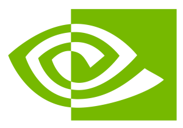
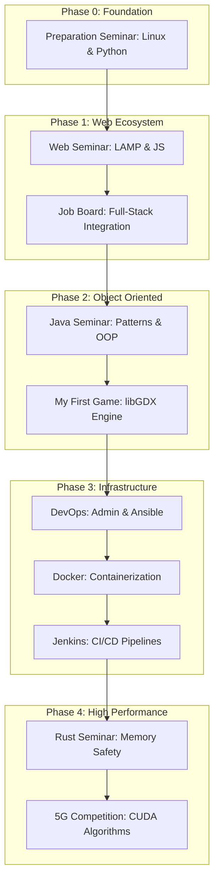

<!-- markdownlint-disable MD033 -->
<div align="center">
  
  <br />
  
  
  
</div>
<!-- markdownlint-enable MD033 -->

## Overview

This repository serves as a professional portfolio for all technical seminars and high-stakes projects (Days 01-80). It is structured to provide both a horizontal view of the curriculum and a vertical deep-dive into the technical implementation of every daily challenge.

### Project Structure

```text
piscine/
├── seminar-preparation/     # Days 01-10 : Linux, Python, algorithms
├── seminar-web/             # Days 11-20 : HTML, CSS, JavaScript, PHP
├── seminar-job-board/       # Days 21-30 : Full-stack project
├── seminar-java/            # Days 31-40 : OOP, generics, design patterns
├── seminar-my-first-game/   # Days 41-55 : 2D game development (libGDX)
├── seminar-devops/          # Days 56-60 : Administration, virtualization, automation
├── seminar-docker/          # Days 60-67 : Containerization, orchestration, microservices
├── seminar-jenkins/         # Days 66-70 : Jenkins, CI/CD, Configuration as Code
├── seminar-rust/            # Days 71-80 : Rust, memory safety, ownership, full-stack
├── seminar-project-management/ # T-CEN-500 : Project management
└── competition/                # 5G antenna optimization competition
```

---

## Technical Core

| Domain | Implementation |
|---|---|
| **System & Logic** |    |
| **Web & API** |    |
| **Infra & DevOps** |    |
| **Data & Storage** |    |

---

## Repository Pulse

Line-by-line breakdown of the multi-stack ecosystem (excluding external dependencies):

| Language | Files | Lines | Weight |
|---|---|---|---|
| **Java** | 206 | ~25,000 | 24% |
| **HTML/CSS** | 218 | ~18,000 | 17% |
| **Python** | 106 | ~15,000 | 14% |
| **Rust** | 83 | ~12,000 | 11% |
| **JS** | 41 | ~8,000 | 8% |
| **PHP** | 27 | ~6,000 | 6% |
| **System/YML** | 12 | ~1,200 | 1% |
| **Total** | **~700** | **~105,000** | **100%** |

---

## Seminars Detail

### [Preparation Seminar — Days 01-10](seminar-preparation/README.md)
Linux fundamentals, Python scripting, and introductory graphics development with **Turtle** and **Pygame**.

    

### [Web Seminar — Days 11-20](seminar-web/README.md)
Semantic HTML5/CSS, client-side JavaScript, and PHP integration.

    

### [Job Board Seminar — Days 21-30](seminar-job-board/README.md)
Full-stack recruitment platform with REST API and database integration.

   

### [Java Seminar — Days 31-40](seminar-java/README.md)
Object-oriented mastery: generics, reflection, and fundamental design patterns.

   

### [My First Game Seminar — Days 41-55](seminar-my-first-game/README.md)
2D game development using libGDX, adhering to SOLID principles and modular architecture.

   

### [DevOps Seminar — Days 56-60](seminar-devops/README.md)
Linux administration, advanced networking, system security, and Ansible automation.

    

### [Docker Seminar — Days 60-67](seminar-docker/README.md)
Containerization and microservices orchestration with Docker Compose.

   

### [Jenkins Seminar — Days 66-70](seminar-jenkins/README.md)
Continuous Integration with Jenkins and Configuration as Code pipelines.

  

### [Rust Seminar — Days 71-80](seminar-rust/README.md)
Memory-safe systems programming and Discord-like real-time messaging.

   

### [Project Management Seminar — SmartFridge (T‑CEN‑500)](seminar-project-management/README.md)
Holistic project management around the SmartFridge product: Gantt planning, budget, resources, and risk communication.

  

### [Code Competition — 5G or not 5G?](competition/README.md)
Algorithmic optimization for 5G antenna network deployment using CUDA.

  

---

## Curriculum Roadmap



---

## Technologies Covered

### Backend
- **Python**: Scripts, algorithms, console applications
- **Java**: OOP, generics, design patterns, libGDX
- **PHP**: Web backend, REST API, database integration
- **Rust**:  Memory safety, zero-cost abstractions, Axum, Tauri

### Frontend
- **HTML5/CSS3**: Semantic, responsive, Materialize
- **JavaScript ES6+**: DOM, events, fetch API, validation
- **Modern UI**:   

### Databases
- **MySQL / MariaDB**: Relational schemas, SQL queries, PDO
- **PostgreSQL**: Relational database, advanced queries, Docker integration
- **NoSQL**:  

### System & DevOps
- **Linux/Debian**: System administration, service management
- **Virtualization**: VirtualBox, virtual machines, snapshots
- **Network**: DHCP (kea-dhcp4-server), DNS (bind9), routing, nftables
- **Security**: SSH, fail2ban, firewall, authentication
- **Automation**: Ansible (Infrastructure as Code), bash scripts, cron
- **CI/CD**: Jenkins pipelines, GitHub Actions, Docker Compose

### Algorithms & Optimization
- **Greedy algorithms**: Local optimization strategies
- **Clustering**: Spatial grouping for shared antenna coverage
- **GPU Acceleration**: NVIDIA CUDA, Numba JIT, vectorized computations
