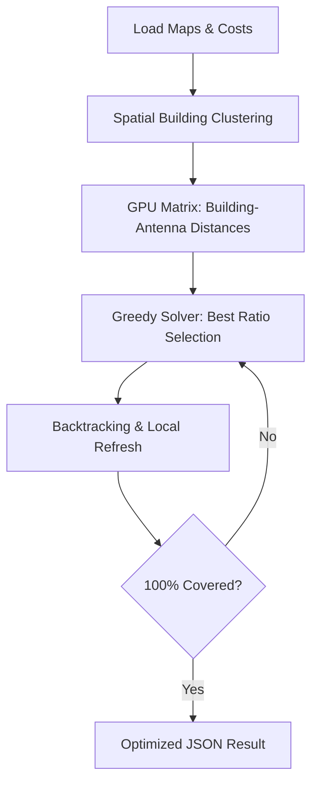

<!-- markdownlint-disable MD033 -->

  
   
  
  
  

<!-- markdownlint-enable MD033 -->

# Code Competition: 5G or not 5G?

A high-stakes algorithmic sprint: solving the multi-dimensional challenge of optimal 5G antenna placement with cost efficiency and massive scale in mind.

---

> [!IMPORTANT]
> **The Challenge**: 
> - **Input**: City maps with building coordinates and varying populations.
> - **Hardware**: Diverse 5G antenna types with specific costs and ranges.
> - **Constraint**: 100% population coverage at the **absolute minimum cost**.

## Technical Core

| Layer | Implementation |
|---|---|
| **Logic** |  |
| **GPU** |   |
| **Math** |   |
| **Vis** |  |

### Heuristic Optimization Logic

---

## 📅 The Implementation (god_tier_cuda.py)

- **Vectorized Pre-computation**: Using NumPy/CuPy to calculate millions of building-antenna distance pairs in milliseconds.
- **Weighted Greedy Heuristic**: Selecting positions based on dynamic `Potential Population Coverage / Installation Cost` ratios.
- **CUDA JIT Acceleration**: Critical kernels implemented with **Numba** to leverage thousands of GPU cores for distance matrices.
- **Local Perturbation**: Fine-tuning the final placement to eliminate redundant antennas.

---

## 🎨 Skills developed

- **Algorithmic Mastery**: Mastering combinatorial optimization and high-level heuristics.
- **GPU Engineering**: Bridging Python logic with high-performance CUDA kernels.
- **Complex Modeling**: Translating business cost-constraints into mathematical objective functions.
- **Performance at Scale**: Designing systems capable of processing thousands of buildings in seconds.
