<p align="center">
  
  <br><br>
  <strong><a href="bookworm.py">Bookworm</a> • <a href="pipeline/">Pipeline</a> • <a href="docs/support.pdf">Support</a> • <a href="docs/assets/diagrams/">Diagrammes</a></strong>
</p>

Bookworm est un projet NLP léger construit à partir de livres Project Gutenberg.
Le dépôt est organisé autour d'une CLI finale, [`bookworm.py`](bookworm.py),
d'un objet `Book` partagé ([`core/book.py`](core/book.py)), d'une couche de
données ([`core/data.py`](core/data.py)), d'une couche de mémoire cache
([`core/cache.py`](core/cache.py)) et d'un module de chaîne de traitement par
fonctionnalité NLP demandée ([`pipeline/`](pipeline/)).

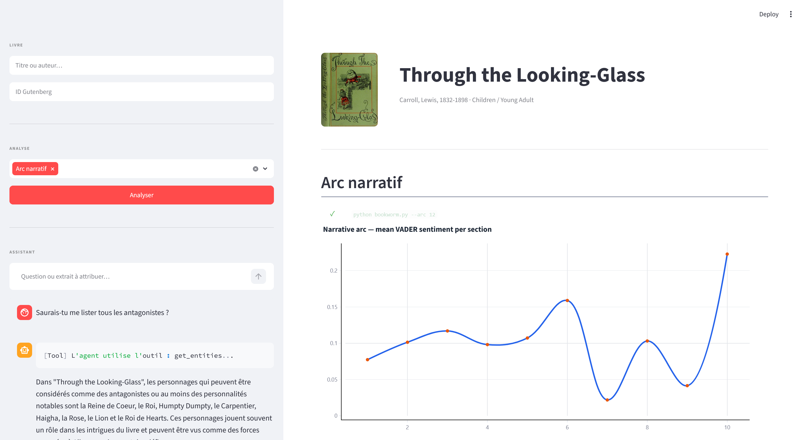

| Tools | Associated |
| :--- | :--- |
| 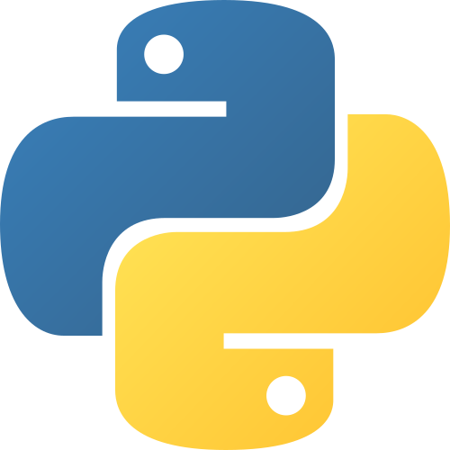 | 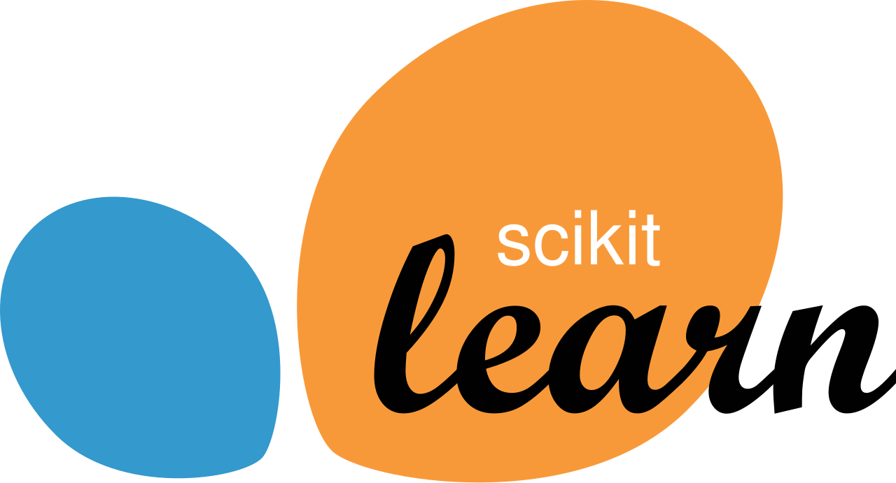 |
|  |  |
|  |  |
|  |  |

## Structure du dépôt

```text
T-AIA-600-PAR_14/
|-- README.md
|-- app.py                      # Streamlit
|-- assistant.py
|-- bookworm.py                 # CLI
|-- install.bat
|-- install.sh
|-- pyproject.toml
|-- core/
|   |-- agent_schema.py
|   |-- book.py
|   |-- cache.py
|   |-- data.py
|   |-- nlp.py
|   |-- tools.py
|   `-- utils.py
|-- pipeline/
|   |-- arc.py
|   |-- attribute.py
|   |-- bert.py
|   |-- card.py
|   |-- charts.py
|   |-- compare.py
|   |-- entities.py
|   |-- lexdiv.py
|   |-- registry.py
|   |-- report.py
|   |-- report_template.html    # Template de rapport
|   |-- rouge.py
|   |-- similar.py
|   |-- summarize.py
|   |-- syntax.py
|   |-- topics.py
|   `-- utils.py
|-- data/
|   |-- input/
|   |   |-- collection.csv      # Métadonnées
|   |   |-- pg_catalog.csv      # Catalogue Gutenberg
|   |   |-- references/         # ROUGE
|   |   `-- texts/              # Textes bruts
|   `-- output/                 # Caches
|-- docs/
|   |-- assets/
|   |   |-- app.css
|   |   |-- diagrams/           # Mermaid / Pngs
|   |   |   |-- mermaid/
|   |   |   `-- png/
|   |   |-- icons/
|   |   `-- preview/
|   `-- support.pdf             # Support de présentation
`-- tests/
    |-- conftest.py
    |-- golden/                 # Golden files
    `-- test_*.py               # Tests unitaires
```

## Installation

1. Clonez le dépôt et entrez dans le dossier :
```bash
git clone https://github.com/EpitechMscProPromo2028/T-AIA-600-PAR_14.git
cd T-AIA-600-PAR_14
```

Ou avec SSH :
```bash
git clone git@github.com:EpitechMscProPromo2028/T-AIA-600-PAR_14.git
cd T-AIA-600-PAR_14
```

2. Exécutez le script d'installation automatique :

Windows (`cmd.exe` ou PowerShell) :
```cmd
install.bat
```

Linux / macOS :
```bash
bash install.sh
```

Le script crée le venv, installe les dépendances pinnées, télécharge les
ressources NLTK (`python core/utils.py`) et le modèle spaCy `en_core_web_sm`.

3. Activez l'environnement virtuel Python :

Windows :
```cmd
venv\Scripts\activate.bat
```

Linux / macOS :
```bash
source venv/bin/activate
```

4. Activer les commandes DistilBERT :
```bash
python -m pip install --index-url https://download.pytorch.org/whl/cpu "torch==2.9.1+cpu"
python -m pip install -e ".[bert]"
```

Sous macOS et Windows, `pip install torch` suffit aussi : l'index CPU explicite
n'est nécessaire que sous Linux, ou pip tirerait sinon une distribution CUDA
inutilement lourde.

5. Installer l'interface web :
```bash
python -m pip install -e ".[web]"
python -m streamlit run app.py
```

6. Lancer la suite de tests :
```bash
python -m pip install -e ".[dev]"
python -m pytest -q
```

## Assistant local (`--ask`)

Assistant optionnel via Ollama/Qwen2.5. Il peut chercher dans le texte ouvert et
appeler les pipelines NLP du projet comme outils (`topics`, `lexdiv`, `summary`,
etc.) ; aucune autre commande de `bookworm.py` n'en dépend.

Commande interactive (posez votre question dans l'invite) :

```bash
python bookworm.py --ask 345
```

Commande directe :

```bash
python bookworm.py --ask 345 "Qui est Van Helsing ?"
```

Rechercher et télécharger des livres (via Gutenberg OPDS paginé, fallback catalogue local) :

```bash
python bookworm.py --author "Bram Stoker"
python bookworm.py --category "Dracula" --limit 10
```

Ces deux commandes téléchargent les résultats renvoyés par la recherche OPDS
paginée. `--category` reste une recherche texte par sujet, pas une taxonomie
Gutenberg exhaustive. Sans `--limit`, tous les résultats sont téléchargés —
une catégorie large peut en renvoyer plus d'un millier.

## Fonctionnement

### Composants principaux

| Fichier | Rôle |
| :--- | :--- |
| [`bookworm.py`](bookworm.py) | CLI : arguments, dispatch, cache et sortie finale. |
| [`app.py`](app.py) | Interface Streamlit sur les pipelines existants. |
| [`assistant.py`](assistant.py) | Assistant Ollama/Qwen2.5 avec accès aux outils NLP. |
| [`core/book.py`](core/book.py) | Objet `Book` paresseux : texte, phrases, mots, métadonnées. |
| [`core/data.py`](core/data.py) | Textes Gutenberg : corpus local, téléchargement, recherche OPDS. |
| [`core/tools.py`](core/tools.py) | Métadonnées : catalogues locaux, cache `info.json`, Gutendex. |
| [`core/cache.py`](core/cache.py) | Cache JSON versionné dans `data/output/cache/<id>/`. |

### Pipeline

```text
pipeline/
|-- lexdiv.py
|-- topics.py
|-- entities.py
|-- card.py
|-- summarize.py
|-- similar.py
|-- arc.py          # bonus
|-- bert.py         # bonus
|-- compare.py      # bonus
|-- report.py       # bonus
|-- rouge.py        # bonus
`-- syntax.py       # bonus
```


#### [`pipeline/lexdiv.py`](pipeline/lexdiv.py) : diversité lexicale sur `book.words`.

Commandes :

```bash
python bookworm.py --lexdiv 345
python bookworm.py --lexdiv-plus 345
```

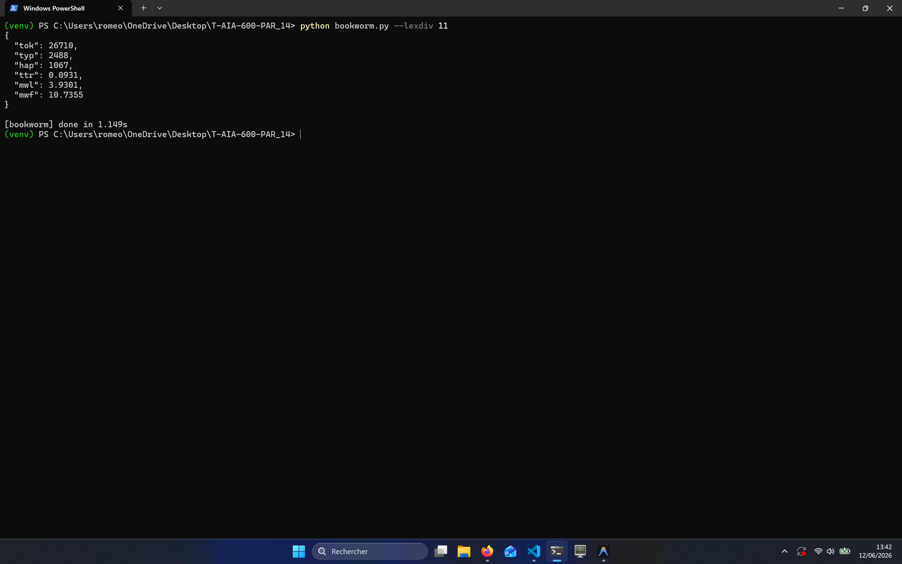

> **Algorithme** : 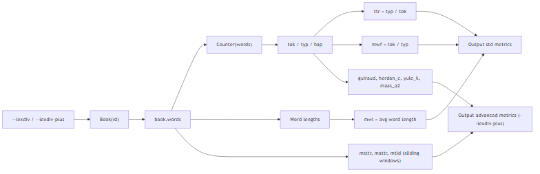

Profiling :

```txt
  _     ._   __/__   _ _  _  _ _/_   Recorded: 14:30:22  Samples:  1457
 /_//_/// /_\ / //_// / //_'/ //     Duration: 1.580     CPU time: 1.453
/   _/                      v5.1.2

Program: bookworm.py --lexdiv 345

1.577 <module>  bookworm.py:1
`- 1.574 main  bookworm.py:139
   `- 1.573 dispatch  bookworm.py:76
      `- 1.573 <module>  core\book.py:1
         |- 1.523 <module>  nltk\__init__.py:1
         |     [160 frames hidden]  nltk, scipy, importlib, <string>, num...
         `- 0.048 <module>  core\data.py:1
            `- 0.047 <module>  requests\__init__.py:1
               `- 0.023 <module>  urllib3\__init__.py:1
```

#### [`pipeline/topics.py`](pipeline/topics.py) : sections TF-IDF, thèmes NMF et mots dominants.

Commandes :

```bash
python bookworm.py --topics 345
python bookworm.py --compare 345
```

> **Algorithme** : 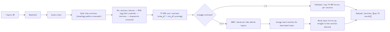

Profiling :

```txt
  _     ._   __/__   _ _  _  _ _/_   Recorded: 14:30:24  Samples:  1446
 /_//_/// /_\ / //_// / //_'/ //     Duration: 1.564     CPU time: 1.453
/   _/                      v5.1.2

Program: bookworm.py --topics 345

1.561 <module>  bookworm.py:1
`- 1.559 main  bookworm.py:139
   `- 1.558 dispatch  bookworm.py:76
      |- 1.513 <module>  core\book.py:1
      |  |- 1.463 <module>  nltk\__init__.py:1
      |  |     [158 frames hidden]  nltk, scipy, importlib, <string>, num...
      |  `- 0.047 <module>  core\data.py:1
      |     `- 0.047 <module>  requests\__init__.py:1
      |        `- 0.022 <module>  urllib3\__init__.py:1
      `- 0.045 run_book_command  pipeline\registry.py:45
         `- 0.045 _resolve  pipeline\registry.py:40
            `- 0.045 import_module  importlib\__init__.py:71
               `- 0.045 <module>  pipeline\topics.py:1
                  `- 0.034 <module>  sklearn\cluster\__init__.py:1
```

#### [`pipeline/entities.py`](pipeline/entities.py) : personnages et lieux avec spaCy NER.

Commande :

```bash
python bookworm.py --entities 345
```

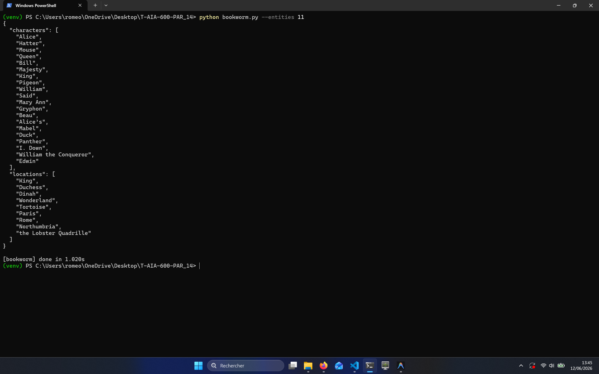

> **Algorithme** : 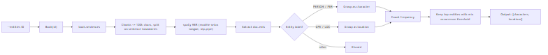

Profiling :

```txt
  _     ._   __/__   _ _  _  _ _/_   Recorded: 14:30:26  Samples:  1401
 /_//_/// /_\ / //_// / //_'/ //     Duration: 1.518     CPU time: 1.422
/   _/                      v5.1.2

Program: bookworm.py --entities 345

1.516 <module>  bookworm.py:1
`- 1.513 main  bookworm.py:139
   `- 1.513 dispatch  bookworm.py:76
      `- 1.510 <module>  core\book.py:1
         |- 1.460 <module>  nltk\__init__.py:1
         |     [155 frames hidden]  nltk, scipy, importlib, <string>, num...
         `- 0.048 <module>  core\data.py:1
            `- 0.048 <module>  requests\__init__.py:1
               `- 0.023 <module>  urllib3\__init__.py:1
```

#### [`pipeline/summarize.py`](pipeline/summarize.py) : résumé extractif par TF-IDF, LSA et K-Means.

Commande :

```bash
python bookworm.py --summarize 345
```

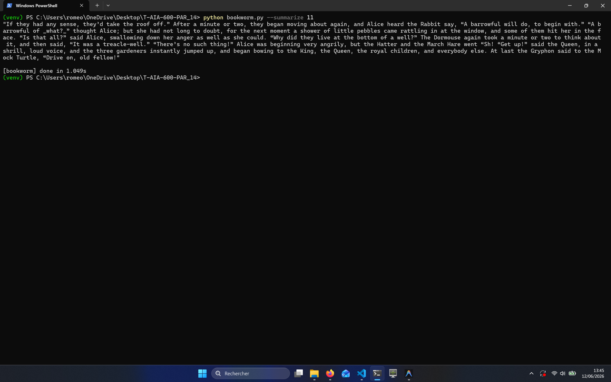

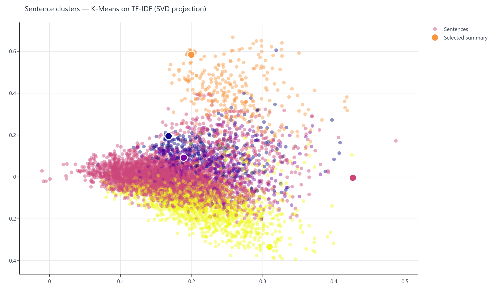

> **Algorithme** : 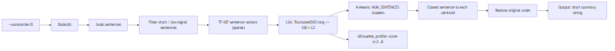

Profiling :

```txt
  _     ._   __/__   _ _  _  _ _/_   Recorded: 14:30:28  Samples:  1438
 /_//_/// /_\ / //_// / //_'/ //     Duration: 1.554     CPU time: 1.406
/   _/                      v5.1.2

Program: bookworm.py --summarize 345

1.551 <module>  bookworm.py:1
`- 1.547 main  bookworm.py:139
   `- 1.547 dispatch  bookworm.py:76
      |- 1.504 <module>  core\book.py:1
      |  |- 1.455 <module>  nltk\__init__.py:1
      |  |     [155 frames hidden]  nltk, scipy, importlib, <string>, num...
      |  `- 0.047 <module>  core\data.py:1
      |     `- 0.047 <module>  requests\__init__.py:1
      |        `- 0.022 <module>  urllib3\__init__.py:1
      `- 0.043 run_book_command  pipeline\registry.py:45
         `- 0.043 _resolve  pipeline\registry.py:40
            `- 0.043 import_module  importlib\__init__.py:71
               `- 0.043 <module>  pipeline\summarize.py:1
                  `- 0.042 <module>  sklearn\cluster\__init__.py:1
```

#### [`pipeline/similar.py`](pipeline/similar.py) : recommandations cosinus, collection ou plein corpus.

Commandes :

```bash
python bookworm.py --similar 345
python -m pipeline.similar
```

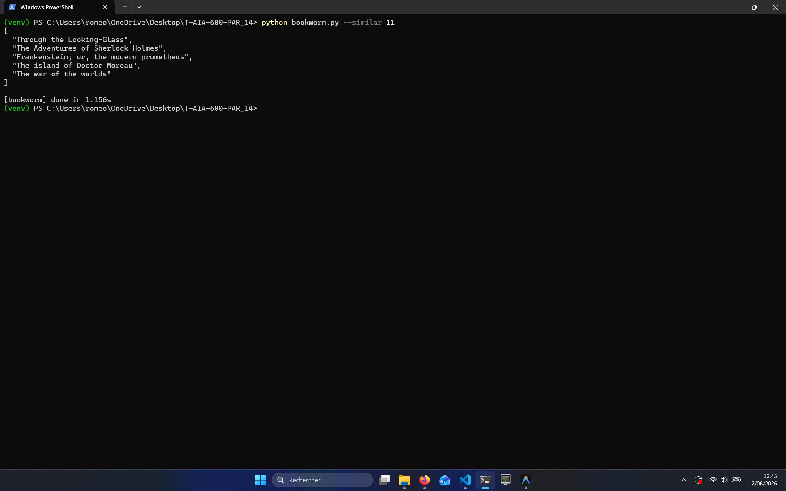

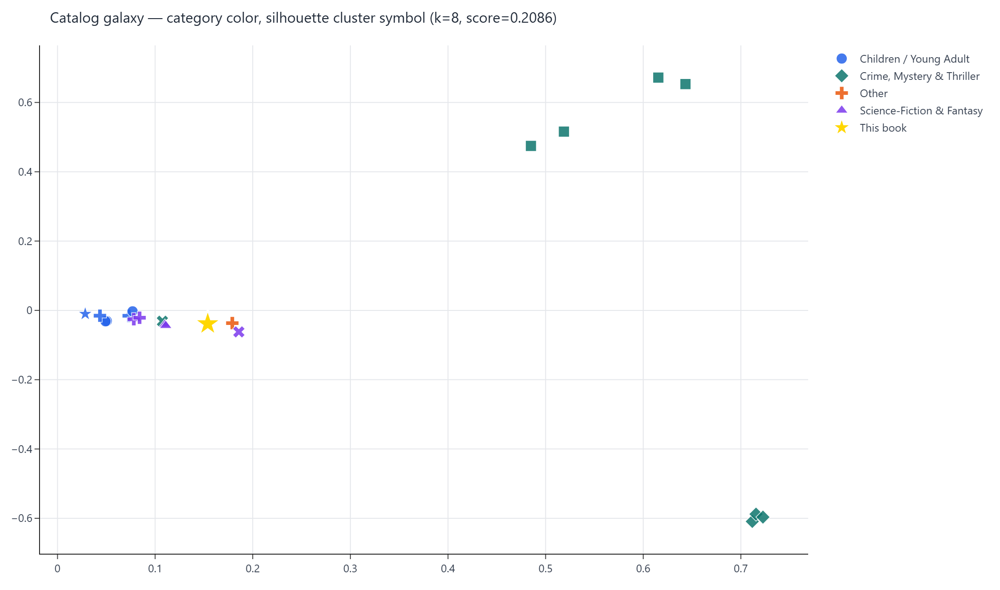

> **Algorithme** : 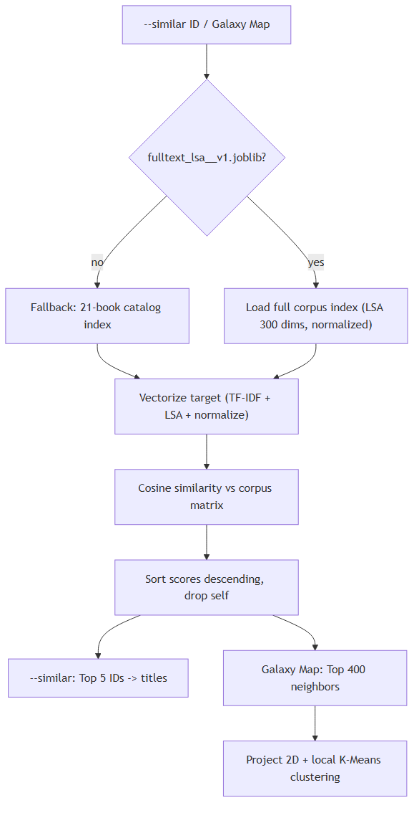

Profiling :

```txt
  _     ._   __/__   _ _  _  _ _/_   Recorded: 14:30:30  Samples:  1453
 /_//_/// /_\ / //_// / //_'/ //     Duration: 1.570     CPU time: 1.453
/   _/                      v5.1.2

Program: bookworm.py --similar 345

1.568 <module>  bookworm.py:1
`- 1.565 main  bookworm.py:139
   `- 1.564 dispatch  bookworm.py:76
      |- 1.520 <module>  core\book.py:1
      |  |- 1.472 <module>  nltk\__init__.py:1
      |  |     [159 frames hidden]  nltk, scipy, importlib, <string>, num...
      |  `- 0.046 <module>  core\data.py:1
      |     `- 0.045 <module>  requests\__init__.py:1
      |        `- 0.021 <module>  urllib3\__init__.py:1
      `- 0.044 run_book_command  pipeline\registry.py:45
         `- 0.044 _resolve  pipeline\registry.py:40
            `- 0.044 import_module  importlib\__init__.py:71
               `- 0.043 <module>  pipeline\similar.py:1
                  `- 0.042 <module>  sklearn\cluster\__init__.py:1
```

#### [`pipeline/arc.py`](pipeline/arc.py) : arc narratif par sentiment VADER sectionné.

```bash
python bookworm.py --arc 345
```

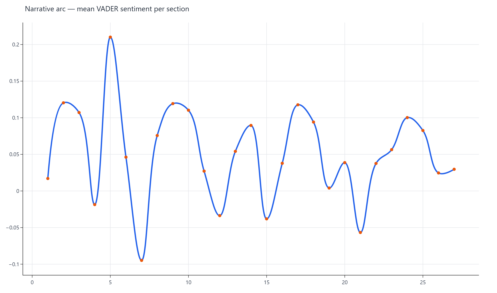

#### [`pipeline/card.py`](pipeline/card.py) : fiche livre agrégée et rapport HTML autonome.

Commandes :

```bash
python bookworm.py --card 345
python bookworm.py --report 345
```

#### [`pipeline/bert.py`](pipeline/bert.py) : résumé, similarité et topics avec DistilBERT local.

Les poids `distilbert-base-uncased` sont téléchargés une seule fois dans le
cache Hugging Face standard, sans API externe.

Commandes :

```bash
python bookworm.py --summarize-bert 11
python bookworm.py --similar-bert 11
python bookworm.py --topics-bert 11
```

`--topics-bert` retourne des clusters de sections avec leurs mots-clés
représentatifs. Sous Windows, `peak_memory_mb` peut valoir `0.0` car l'API
standard utilisée pour mesurer le pic mémoire (`resource`) n'est pas disponible.

#### [`pipeline/rouge.py`](pipeline/rouge.py) : évaluation ROUGE avec références Wikipédia locales ou cachées.

Si aucune référence locale n'existe dans
[`data/input/references/`](data/input/references/), le module cherche une intro
Wikipédia par variantes du titre Gutenberg, `titre + auteur`, fallback anglais
et filtre de désambiguïsation. Les références trouvées au runtime sont écrites
dans `data/output/cache/references/`. Le score mesure le recouvrement lexical :
utile pour comparer deux résumés, pas pour juger seul la qualité éditoriale.

Commande :

```bash
python bookworm.py --eval-summary 11
```

#### [`pipeline/syntax.py`](pipeline/syntax.py) : profil syntaxique, auteur moyen et attribution.

Commandes :

```bash
python bookworm.py --syntax 345
python bookworm.py --authorsyntax Doyle
python bookworm.py --attribute "It was a dark and stormy night, and the rain fell in torrents."
```

`--authorsyntax` compare le profil moyen d'un auteur au reste de la collection
et génère un radar chart dans `data/output/cache/authorsyntax/`. Auteurs
supportés (au moins deux livres dans la collection) : `Carroll`, `Doyle`,
`Christie`, `Wells`.

## Profiling d'exécution

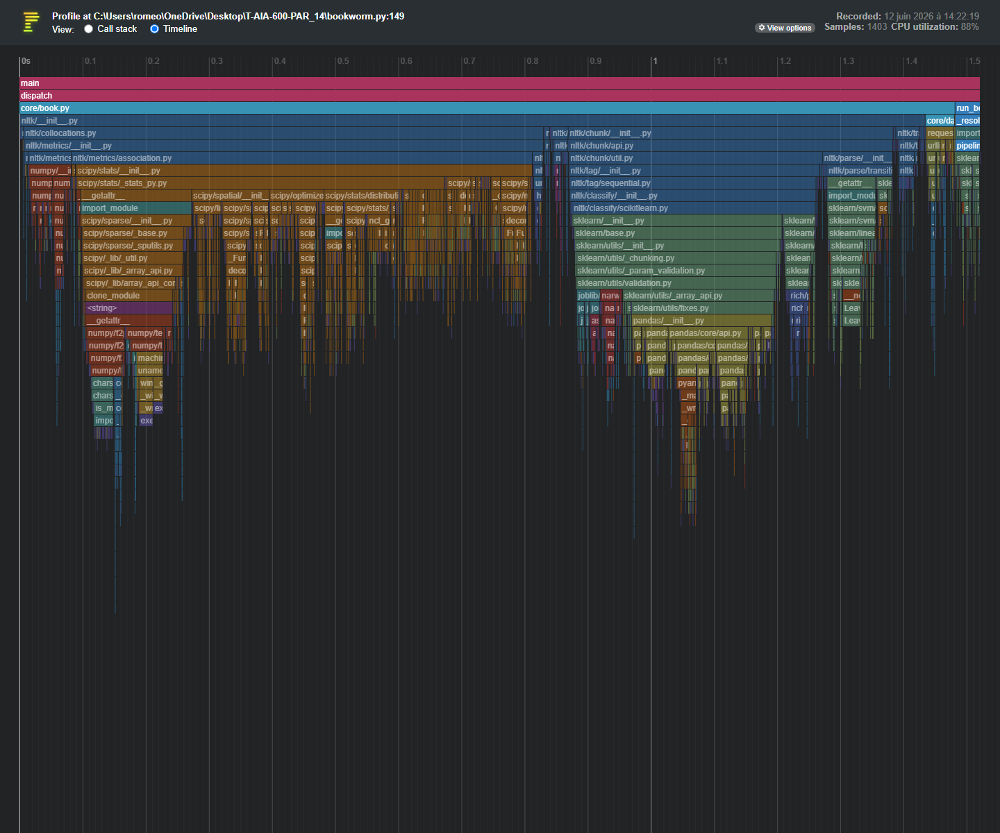

La CLI intègre le flag `--profile` qui génère un rapport HTML interactif
(`profile_audit.html`) permettant de naviguer entre la vue call stack et la vue
timeline. Les sections de pipeline ci-dessus gardent les call stacks en blocs
`txt`; l'image ci-dessous montre la vue timeline exportée depuis Pyinstrument.

| Commande | Coût | Temps |
| :--- | :--- | ---: |
| `python bookworm.py --lexdiv 345` | \(O(n)\) tokens | 1.340s |
| `python bookworm.py --topics 345` | TF-IDF + NMF | 4.183s |
| `python bookworm.py --entities 345` | spaCy NER | 7.853s |
| `python bookworm.py --summarize 345` | TF-IDF + LSA + K-Means | 4.747s |
| `python bookworm.py --similar 345` | TF-IDF + cosinus | 1.339s |
| `python bookworm.py --compare 345` | NMF + LSA + LDA | 4.327s |
| `python bookworm.py --report 345` | Plotly + Kaleido | 16.591s |
| `python bookworm.py --summarize-bert 11` | DistilBERT | 16.281s |
| `python bookworm.py --topics-bert 11` | DistilBERT + K-Means | 1.441s |
| `python bookworm.py --similar-bert 11` | DistilBERT + cosinus | 8.656s |
