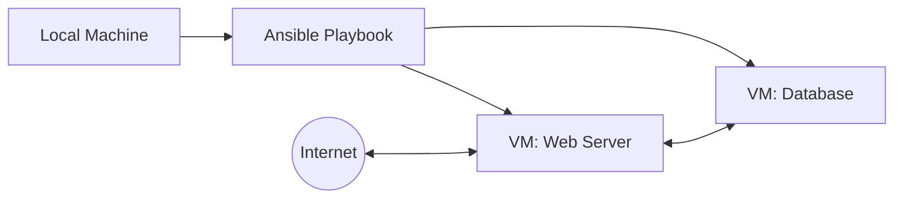

<!-- markdownlint-disable MD033 -->

  
   
  
  
  

<!-- markdownlint-enable MD033 -->

# Seminar: Systems, Networking & DevOps

Moving from software to infrastructure: mastering the art of automated deployment, secure networking, and planetary-scale system administration.

---

> [!IMPORTANT]
> **Core Objectives**: 
> - **IaC Excellence**: Automating server configuration with **Ansible**.
> - **Network Engineering**: Mastering DHCP, DNS, and secure routing.
> - **Security Baseline**: Implementing fail2ban, nftables, and SSH hardening.
> - **Virtualization**: Deploying and managing complex VM architectures with **VirtualBox**.

## Technical Core

| Layer | Implementation |
|---|---|
| **OS** |  |
| **Automation** |  |
| **Networking** |   |
| **Web** |   |

### Infrastructure Workflow

---

## 📅 Chronological Journey

- **Day 56**: Virtualization & Debian basics: setting up the baseline environment and SSH security.
- **Day 57**: Advanced Networking: DHCP (Kea), DNS (Bind9), and internal routing with nftables.
- **Day 58-59**: Web Stack & DB: Apache2, Nginx, MariaDB, and secure application deployment.
- **Day 60**: Final Automation: Complete site orchestration with complex **Ansible** roles.

---

## 🎨 Skills developed

- **Infrastructural Vision**: Understanding how bits flow across hardware and software layers.
- **Automation First**: Eliminating manual tasks through robust IaC playbooks.
- **Defensive Engineering**: Building secure-by-design systems against external threats.
- **System Stability**: Implementing logging, monitoring, and reliable service orchestration.
