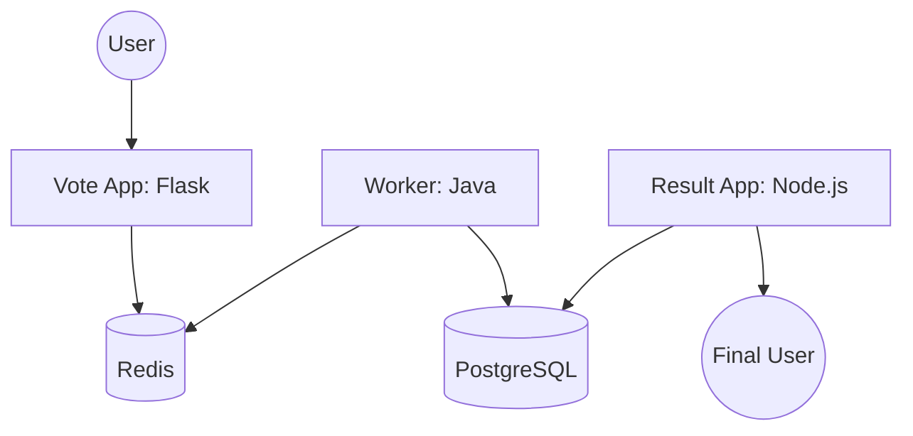

<!-- markdownlint-disable MD033 -->

  
   
  
  
  

<!-- markdownlint-enable MD033 -->

# Seminar: Containerization & Microservices

Mastering the paradigm shift of containerization: isolating applications, managing dependencies, and orchestrating complex distributed systems with Docker and Docker Compose.

---

> [!IMPORTANT]
> **Core Objectives**: 
> - **Container Mastery**: Building optimized images with multi-stage Dockerfiles.
> - **Orchestration**: Designing complex inter-service networks with **Docker Compose**.
> - **Architecture**: Deploying the **Popeye** project (distributed voting app).
> - **Persistence**: Managing volumes, bind mounts, and database state.

## Technical Core

| Layer | Implementation |
|---|---|
| **Engine** |  |
| **Orchestration** |  |
| **Languages** |   |
| **Databases** |   |

### Microservices Architecture (Project Popeye)

---

## Chronological Journey

- **Day 60-62**: Docker Fundamentals: basic images, containers, and volumes.
- **Day 63-64**: **Bootstrap Project**: Containerizing a Node.js stack with PostgreSQL.
- **Day 65-67**: **Project Popeye**: Orchestrating a 5-tier microservices architecture.

---

## Skills developed

- **Isolation Excellence**: Resolving "it works on my machine" through containerization.
- **Distributed Thinking**: Understanding communication protocols between isolated services.
- **Optimized Builds**: Implementing multi-stage builds to minimize image size.
- **Infrastructure as Logic**: Defining complex stack dependencies in YAML.

