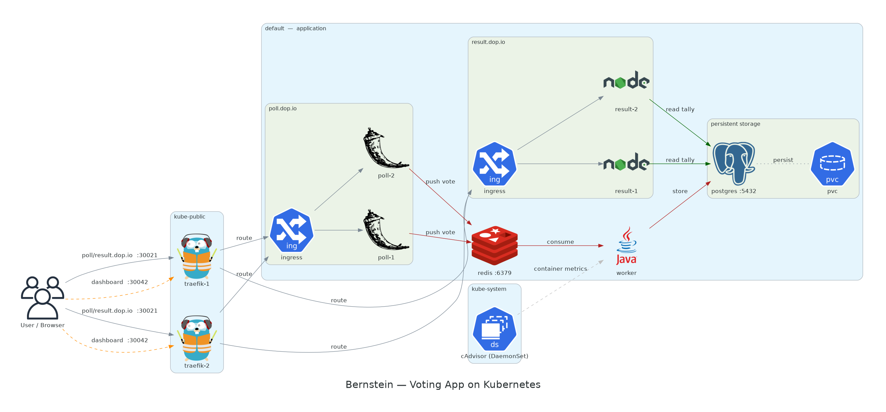
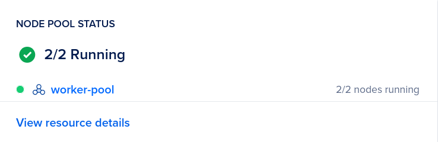
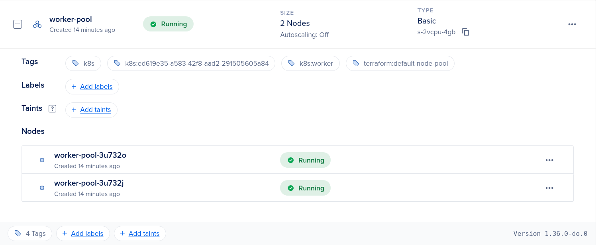
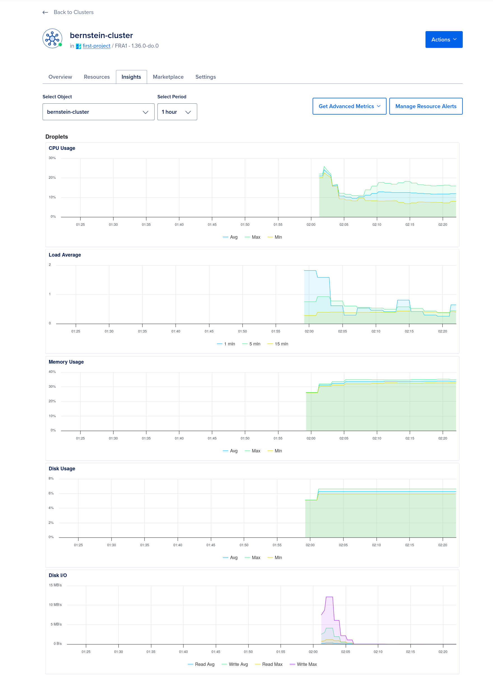
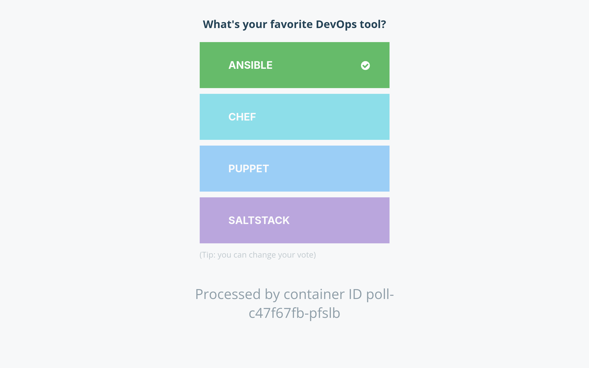
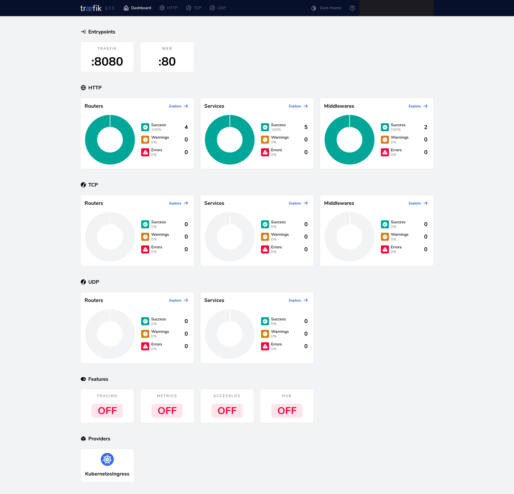
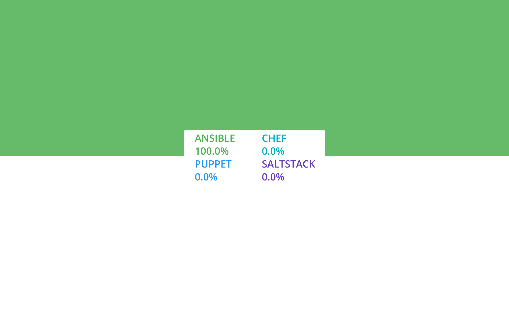

<div align="center">

# Bernstein

### Containers Symphony Orchestration

*Become the Leonard Bernstein of containers — orchestrate a multi-service voting application on Kubernetes.*

<br />

[](https://kubernetes.io/)
[](https://www.terraform.io/)
[](https://traefik.io/)
[](https://www.digitalocean.com/)
[](https://nixos.org/)

<br /><br />



</div>

<br />

---

## About

A Kubernetes deployment of a **distributed voting application** across a multi-node cloud cluster. Users vote through a Flask web interface, votes transit via a Redis queue, a Java worker persists them to PostgreSQL, and a Node.js dashboard displays live results — all orchestrated by Traefik as a reverse proxy and load balancer.

Infrastructure is provisioned on **DigitalOcean** (DOKS) via **Terraform**, and the development environment is fully reproducible with **Nix**.

---

## Project Structure

```
bernstein/
│
├── Kubernetes Manifests (root)
│   ├── cadvisor.daemonset.yaml
│   ├── poll.deployment.yaml
│   ├── poll.ingress.yaml
│   ├── poll.service.yaml
│   ├── postgres.configmap.yaml
│   ├── postgres.deployment.yaml
│   ├── postgres.secret.yaml
│   ├── postgres.service.yaml
│   ├── postgres.volume.yaml
│   ├── redis.configmap.yaml
│   ├── redis.deployment.yaml
│   ├── redis.service.yaml
│   ├── result.deployment.yaml
│   ├── result.ingress.yaml
│   ├── result.service.yaml
│   ├── traefik.deployment.yaml
│   ├── traefik.rbac.yaml
│   ├── traefik.service.yaml
│   └── worker.deployment.yaml
│
├── bootstrap/              Local Minikube exercises
│   ├── hello-world.pod.yaml
│   ├── hello-world.service.yaml
│   ├── hello-world.volume.yaml
│   ├── hello-world.deployment.yaml
│   └── flake.nix
│
├── terraform/              DOKS cluster provisioning
│   ├── main.tf
│   ├── outputs.tf
│   ├── providers.tf
│   └── variables.tf
│
├── docs/
│   ├── architecture.png
│   ├── kickoff.pdf
│   └── project.pdf
│
├── .env                    API tokens (git-ignored)
├── .gitignore
├── flake.nix               Nix dev environment
└── README.md
```

---

## How It Works

The application follows a classic **event-driven microservices** pattern. A user casts a vote through a Python/Flask web interface. Instead of writing directly to the database (which would be slow under heavy load), the vote is pushed into a **Redis queue** — an ultra-fast in-memory store that absorbs traffic spikes. A **Java worker** continuously watches that queue, picks up each vote, and writes it into **PostgreSQL** for durable storage. On the other side, a **Node.js** dashboard reads from PostgreSQL and displays live results. All external traffic enters through **Traefik**, a cloud-native reverse proxy that routes requests based on the hostname (`poll.dop.io` vs `result.dop.io`) and load-balances across replicas. A **cAdvisor** DaemonSet monitors resource usage on every node.

Shared configuration (hosts, ports, database name) lives in Kubernetes **ConfigMaps**, while sensitive credentials are stored in **Secrets**. Replicated services use **pod anti-affinity** to guarantee they run on different nodes for high availability.

| Service | Tech | Image | Replicas | Port | Role |
|---------|:----:|-------|:--------:|:----:|------|
| **Poll** |  | `epitechcontent/t-dop-600-poll:k8s` | 2 | 80 | Web voting interface |
| **Redis** |  | `redis:5.0` | 1 | 6379 | In-memory vote queue |
| **Worker** |  | `epitechcontent/t-dop-600-worker:k8s` | 1 | — | Queue consumer |
| **PostgreSQL** |  | `postgres:13` | 1 | 5432 | Persistent storage |
| **Result** |  | `epitechcontent/t-dop-600-result:k8s` | 2 | 80 | Live results dashboard |
| **Traefik** |  | `traefik:2.7` | 2 | 80, 8080 | Reverse proxy & LB |
| **cAdvisor** |  | `gcr.io/cadvisor/cadvisor:latest` | all | 8080 | Container monitoring |

### File Index

Every manifest and configuration file, grouped by role. All links are clickable.

### Monitoring

- [cadvisor.daemonset.yaml](cadvisor.daemonset.yaml) — `DaemonSet` — cAdvisor monitoring agent on every node (`kube-system`)

### Databases

- **Redis** — in-memory vote queue
  - [redis.configmap.yaml](redis.configmap.yaml) — `ConfigMap` — `REDIS_HOST` shared configuration
  - [redis.deployment.yaml](redis.deployment.yaml) — `Deployment` — Redis 5.0
  - [redis.service.yaml](redis.service.yaml) — `Service` — ClusterIP exposing Redis on `6379`
- **PostgreSQL** — durable vote storage
  - [postgres.secret.yaml](postgres.secret.yaml) — `Secret` — `POSTGRES_USER` / `POSTGRES_PASSWORD` credentials
  - [postgres.configmap.yaml](postgres.configmap.yaml) — `ConfigMap` — `POSTGRES_HOST` / `PORT` / `DB` shared config
  - [postgres.volume.yaml](postgres.volume.yaml) — `PVC` — persistent storage on `do-block-storage`
  - [postgres.deployment.yaml](postgres.deployment.yaml) — `Deployment` — PostgreSQL 13
  - [postgres.service.yaml](postgres.service.yaml) — `Service` — ClusterIP exposing Postgres on `5432`

### Application Services

- **Poll** — Flask voting front-end
  - [poll.deployment.yaml](poll.deployment.yaml) — `Deployment` — 2 replicas, pod anti-affinity
  - [poll.service.yaml](poll.service.yaml) — `Service` — ClusterIP on `80`
  - [poll.ingress.yaml](poll.ingress.yaml) — `Ingress` — Traefik route for `poll.dop.io`
- **Worker** — Java queue consumer
  - [worker.deployment.yaml](worker.deployment.yaml) — `Deployment` — consumes Redis → writes Postgres
- **Result** — Node.js results dashboard
  - [result.deployment.yaml](result.deployment.yaml) — `Deployment` — 2 replicas, pod anti-affinity
  - [result.service.yaml](result.service.yaml) — `Service` — ClusterIP on `80`
  - [result.ingress.yaml](result.ingress.yaml) — `Ingress` — Traefik route for `result.dop.io`

### Load Balancer

- **Traefik** — reverse proxy & ingress controller (`kube-public`)
  - [traefik.rbac.yaml](traefik.rbac.yaml) — `RBAC` — ServiceAccount + ClusterRole for the Kubernetes API
  - [traefik.deployment.yaml](traefik.deployment.yaml) — `Deployment` — Traefik 2.7, 2 replicas, anti-affinity
  - [traefik.service.yaml](traefik.service.yaml) — `Service` — NodePort `30021` (proxy) + `30042` (dashboard)

### Bootstrap (local Minikube)

- [bootstrap/hello-world.pod.yaml](bootstrap/hello-world.pod.yaml) — single pod with `PORT=8080` + exposed port
- [bootstrap/hello-world.service.yaml](bootstrap/hello-world.service.yaml) — ClusterIP service for internal DNS
- [bootstrap/hello-world.volume.yaml](bootstrap/hello-world.volume.yaml) — 512Mi PersistentVolume + PVC
- [bootstrap/hello-world.deployment.yaml](bootstrap/hello-world.deployment.yaml) — pod converted into a Deployment

### Infrastructure & Tooling

- [terraform/main.tf](terraform/main.tf) — DOKS cluster (2 worker nodes)
- [terraform/providers.tf](terraform/providers.tf) — DigitalOcean + local providers
- [terraform/variables.tf](terraform/variables.tf) — region & cluster name variables
- [terraform/outputs.tf](terraform/outputs.tf) — kubeconfig output + local file generation
- [flake.nix](flake.nix) — Nix dev shell (kubectl, terraform, doctl…)

---

## Live Deployment

The stack runs on **DigitalOcean Kubernetes (DOKS)** — a 2-node pool (`s-2vcpu-4gb`, 2 vCPU / 4 GB each) provisioned end-to-end by Terraform, running Kubernetes `1.36.0-do.0` in the `fra1` region.

<div align="center">

**Node pool — 2 / 2 nodes running**



<br /><br />

**Worker pool detail — provisioned & tagged by Terraform**



<br /><br />

**Cluster insights — CPU, load, memory, disk & I/O**



</div>

---

## The Application in Action

With the cluster live, the whole event-driven flow can be followed end-to-end straight from the browser.

A voter lands on the **Poll** page and picks their favorite DevOps tool. The footer is the interesting part — `Processed by container ID poll-c47f67fb-pfslb` — proof the request was served by *one of the two* load-balanced Flask pods, not a single static server.

<div align="center">

</div>

That request never reached a pod directly: it entered through **Traefik**, which had discovered the `poll.dop.io` and `result.dop.io` routes on its own via the `KubernetesIngress` provider. Its dashboard shows every HTTP router and service healthy — 100% success, zero errors — on the `:80` (web) and `:8080` (dashboard) entrypoints.

<div align="center">

</div>

From there the vote travelled the full pipeline — Flask → Redis queue → Java worker → PostgreSQL — and the **Result** dashboard, reading live from the database, reflects it instantly: **ANSIBLE at 100%**. The symphony plays in tune.

<div align="center">

</div>

---

## Installation & Configuration

### Prerequisites

- [Nix](https://nixos.org/download.html) package manager
- A [DigitalOcean](https://www.digitalocean.com/) account with an API token
- [Git](https://git-scm.com/)

### Step 1 — Clone & enter environment

```bash
git clone <repo-url> && cd bernstein
cp .env.example .env   # Add your DigitalOcean API token
nix develop            # Loads kubectl, terraform, k9s, helm
```

### Step 2 — Provision cloud cluster

```bash
cd terraform
terraform init
terraform apply        # Creates a 2-worker DOKS cluster (~5 min)
cd ..
export KUBECONFIG=$(pwd)/kubeconfig
```

### Step 3 — Deploy the stack

```bash
# Monitoring
kubectl apply -f cadvisor.daemonset.yaml

# Data layer
kubectl apply -f postgres.secret.yaml \
               -f postgres.configmap.yaml \
               -f postgres.volume.yaml \
               -f postgres.deployment.yaml \
               -f postgres.service.yaml

kubectl apply -f redis.configmap.yaml \
               -f redis.deployment.yaml \
               -f redis.service.yaml

# Application layer
kubectl apply -f poll.deployment.yaml \
               -f worker.deployment.yaml \
               -f result.deployment.yaml \
               -f poll.service.yaml \
               -f result.service.yaml \
               -f poll.ingress.yaml \
               -f result.ingress.yaml

# Load balancer
kubectl apply -f traefik.rbac.yaml \
               -f traefik.deployment.yaml \
               -f traefik.service.yaml
```

### Step 4 — Initialize the database

```bash
POSTGRES_POD=$(kubectl get pods -l app=postgres -o jsonpath='{.items[0].metadata.name}')
echo "CREATE TABLE votes (id text PRIMARY KEY, vote text NOT NULL);" | \
  kubectl exec -i $POSTGRES_POD -c postgres -- psql -U postgres -d postgres
```

### Step 5 — Configure local DNS

```bash
NODES=$(kubectl get nodes -o jsonpath='{ $.items[*].status.addresses[?(@.type=="ExternalIP")].address }')
echo "$NODES poll.dop.io result.dop.io" | sudo tee -a /etc/hosts
```

### Step 6 — Access the application

| Endpoint | URL |
|----------|-----|
| Vote | `http://poll.dop.io:30021` |
| Results | `http://result.dop.io:30021` |
| Traefik Dashboard | `http://localhost:30042` |

### Teardown

```bash
cd terraform && terraform destroy
```

---

<div align="center">

*Epitech Seminar DOP — T-DOP-600*

</div>
