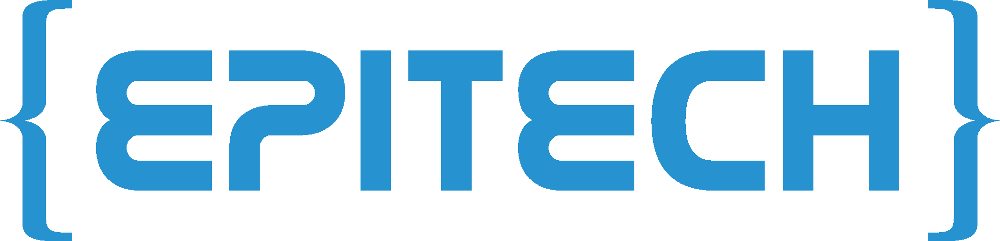

<!-- markdownlint-disable MD033 -->

  
   
  
  
  

<!-- markdownlint-enable MD033 -->

# Seminar: DOP — Bernstein (Kubernetes Orchestration)

Mastering container orchestration at scale: deploying distributed voting applications on Kubernetes clusters, infrastructure-as-code provisioning with Terraform, and cloud-native networking with Traefik.

---

> [!IMPORTANT]
> **Core Objectives**: 
> - **Kubernetes Mastery**: Multi-node cluster deployment and pod orchestration.
> - **Infrastructure as Code**: Cloud provisioning with Terraform on DigitalOcean (DOKS).
> - **Microservices Architecture**: Distributed voting system (Flask, Redis, Java worker, PostgreSQL, Node.js dashboard).
> - **Load Balancing**: Traefik reverse proxy for service routing and high availability.
> - **Reproducible DevOps**: Nix-based development environments for consistency.

## Technical Core

| Layer | Implementation |
|---|---|
| **Orchestration** |   |
| **Infrastructure** |   |
| **Networking** |   |
| **Services** |    |

---

## Chronological Journey

- **Days 121-122**: Bootstrap — Local Minikube essentials (pods, services, ConfigMaps).
- **Days 123-132**: **Bernstein Project** — Full distributed voting app on managed Kubernetes (DOKS).
- **Days 133-135**: **Infrastructure & Automation** — Terraform provisioning, monitoring with cAdvisor, and hardening.

---

## Project Deliverables

See [Day 121-135](Day_121_135/) for:
- **[README.md](Day_121_135/README.md)** — Project details and deployment architecture
- **[OBJECTIVES.md](Day_121_135/OBJECTIVES.md)** — Core learning outcomes
- **[solutions_day121_135/](Day_121_135/solutions_day121_135/)** — All Kubernetes manifests, Terraform code, and bootstrap exercises
