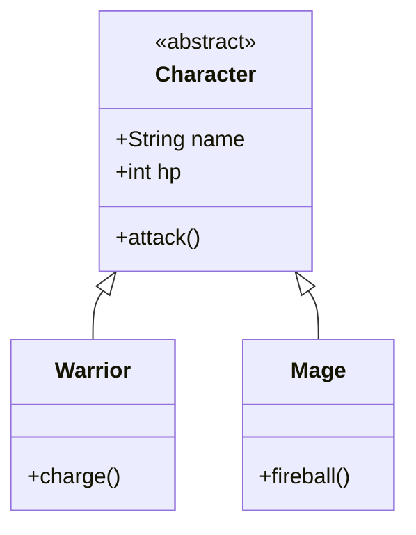

<!-- markdownlint-disable MD033 -->

  
   
  
  
  

<!-- markdownlint-enable MD033 -->

# Seminar: Advanced Object-Oriented Programming (Java)

Diving deep into the world of industrial-grade software engineering through Java: mastering abstraction, design patterns, and the Java Virtual Machine.

---

> [!IMPORTANT]
> **Core Objectives**: 
> - **OOP Mastery**: Deep dive into Encapsulation, Inheritance, and Polymorphism.
> - **Advanced Types**: Leveraging Generics, Interfaces, and Reflection for dynamic code.
> - **Architecture**: Implementing standard **Design Patterns** (Observer, Factory, Singleton).
> - **Build System**: Orchestrating complex dependencies with **Maven**.

## Technical Core

| Layer | Implementation |
|---|---|
| **Language** |  |
| **Build** |  |
| **Testing** |  |
| **IDE** |  |

### Class Hierarchy Model

---

## 📅 Chronological Journey

- **Day 31**: Foundation: Basics, types, and the Java ecosystem.
- **Day 32**: Advanced classes: Inheritance, polymorphism, and the Gecko model.
- **Day 33**: Organization: Packages and modular architecture.
- **Day 34**: Abstraction: Abstract classes, Enums, and the Animal/Cat hierarchy.
- **Day 35**: **Project: Space Arena** - A complete Java application.
- **Day 36**: Interfaces: Contracts, Movable entities, and robust Exception handling.
- **Day 37**: Generics: Type safety for Solo, Pair, and Battalion collections.
- **Day 38**: Design Patterns: Factory, Composite, Observer, and Decorator.
- **Day 39**: Reflection: Inspector tool, custom Annotations, and dynamic analysis.
- **Day 40**: **Final Project: Boulangerie** - Complex system with generics and patterns.

---

## 🎨 Skills developed

- **Architectural Thinking**: Designing self-documenting and maintainable object trees.
- **Strong Typing**: Leveraging the compiler to catch errors before execution.
- **Generic Engineering**: Building high-reusable library-style components.
- **Reflective Power**: Understanding the JVM's dynamic capabilities.