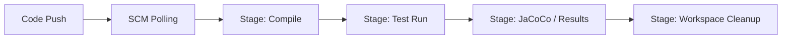

<!-- markdownlint-disable MD033 -->

  
   
  
  
  

<!-- markdownlint-enable MD033 -->

# Seminar: Continuous Integration & Jenkins (MY_MARVIN)

Moving from manual builds to fully automated enterprise pipelines: mastering **Jenkins as Code**, Groovy DSL, and secure CI/CD orchestration.

---

> [!IMPORTANT]
> **Core Objectives**: 
> - **Configuration as Code**: Reproducible Jenkins setup via **JCasC** (YAML).
> - **Programmatic Jobs**: Generating industrial-grade jobs with **Job DSL** (Groovy).
> - **Automated Pipeline**: Implementing `compile → test → clean` lifecycles.
> - **RBAC Security**: Managing fine-grained access with Role-Based Strategy.

## Technical Core

| Layer | Implementation |
|---|---|
| **Server** |  |
| **Config** |   |
| **Logic** |  |
| **SCM** |  |

### Industrial CI Pipeline

---

## Chronological Journey

- **Day 66-67**: JCasC Discovery: Defining a complete Jenkins instance in a single `my_marvin.yml`.
- **Day 68-69**: Job DSL Mastery: Factoring repetitive tasks into a programmatic Groovy script.
- **Day 70**: Full Integration: Deploying an automated pipeline for the **MY_MARVIN** project.

---

## Skills developed

- **Reproducibility Excellence**: Eliminating "click-ops" through declarative configuration.
- **Scale Engineering**: Automating the creation of hundreds of jobs with code.
- **Defensive CI**: Enforcing security protocols and RBAC at the infrastructure level.
- **Workflow Orchestration**: Mastering the handover between SCM, Build, and QA stages.
