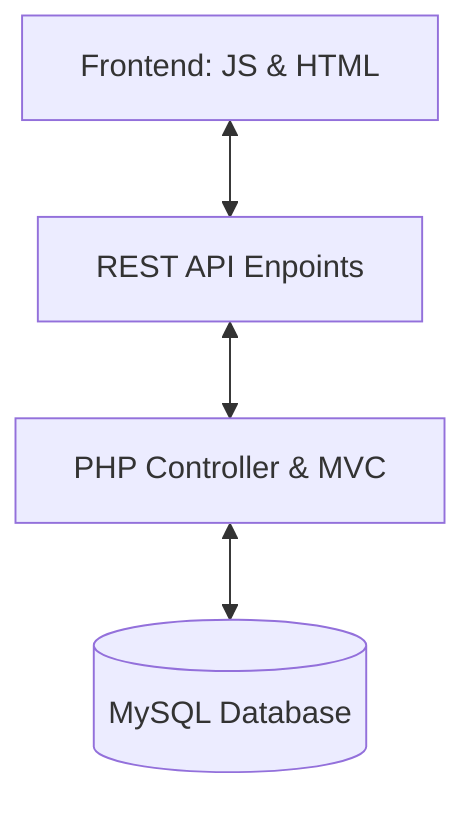

<!-- markdownlint-disable MD033 -->

  
   
  
  
  

<!-- markdownlint-enable MD033 -->

# Seminar: Industrial Web Project (Job Board)

The first large-scale structural project: architecting a complete recruitment platform from scratch, integrating complex business logic with a dynamic interface.

---

> [!IMPORTANT]
> **MVP Scope**: 
> - **User Management**: Authentication, profiles (Candidates/Recruiters).
> - **Job Lifecycle**: Creation, editing, deletion, and advanced application tracking.
> - **API-First Design**: Decoupled REST architecture for future scalabilty.
> - **Security Baseline**: Protection against CSRF, SQL injection, and XSS.

## Technical Core

| Layer | Implementation |
|---|---|
| **Backend** |   |
| **Database** |  |
| **API** |   |
| **Client** |   |

### System Architecture

---

## 📅 Chronological Journey

- **Day 21-22**: Structural design: Database schemas and UML modeling.
- **Day 23-24**: Core backend: User authentication and session management.
- **Day 25-26**: Business logic: Job creation workflow and application system.
- **Day 27-28**: API Development: Building endpoints for remote data access.
- **Day 29-30**: Frontend integration: Orchestrating the UI with the backend API.

---

## 🎨 Skills developed

- **Architectural Vision**: Thinking in terms of MVC and decoupled systems.
- **Data Integrity**: Designing robust relational schemas and complex SQL queries.
- **Secure Coding**: Implementing industrial-grade security protocols.
- **Project Orchestration**: Managing a 10-day intensive development lifecycle.