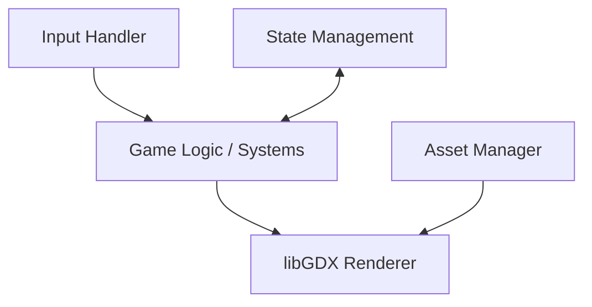

<!-- markdownlint-disable MD033 -->

  
   
  
  
  

<!-- markdownlint-enable MD033 -->

# Seminar: Advanced Game Engineering (libGDX)

Mastering complex project architecture through the lens of 2D game development: implementing SOLID principles, design patterns, and high-performance rendering.

---

> [!IMPORTANT]
> **Core Objectives**: 
> - **Engine Mastery**: 2D rendering, input handling, and lifecycle management with **libGDX**.
> - **Architecture**: Strict adherence to **SOLID** principles in a highly dynamic environment.
> - **Build & Deploy**: Orchestrating cross-platform builds with **Gradle**.
> - **Quality Assurance**: 100% logic coverage with **JUnit** and **JaCoCo**.

## Technical Core

| Layer | Implementation |
|---|---|
| **Language** |  |
| **Engine** |  |
| **Build** |  |
| **Coverage** |   |

### Game Architecture Logic

---

## Chronological Journey

- **Day 41-43**: libGDX discovery: rendering loops, textures, and sprites.
- **Day 44-46**: Input & Interaction: managing keyboard/mouse and physics basics.
- **Day 47-49**: Advanced Logic: Entity Component System (ECS) concepts and state machines.
- **Day 50-52**: Quality Sync: Implementing unit tests and code coverage reports.
- **Day 53-55**: Final Polish: Asset management, UI elements, and cross-platform export.

---

## Skills developed

- **Modular Design**: Breaking down complex systems into decoupled entities.
- **Performance Tuning**: Optimizing memory usage and render calls for 60FPS.
- **Quality Engineering**: Writing testable code in a non-deterministic environment.
- **Pattern Mastery**: Implementing Singleton, Factory, and State patterns in a real-world scenario.

