<!-- markdownlint-disable MD033 -->

<div align="center">
  
  <br />
  <br />
  
  
</div>
<!-- markdownlint-enable MD033 -->

# Séminaire : Théorie des Organisations

Maîtriser les rouages des structures professionnelles : des hiérarchies fonctionnelles traditionnelles aux startups agiles les plus modernes. Comprendre comment l'information circule, comment les décisions se prennent, et comment l'efficacité opérationnelle s'organise et se conçoit.

| Couche                              | Technologies & Approches                                                                                                                                                                  |
| :---------------------------------- | :---------------------------------------------------------------------------------------------------------------------------------------------------------------------------------------- |
| **Méthodologies**            |   |
| **Outils d'Analyse**          |                                                                                       |
| **Écosystème Collaboratif** |                                                                                        |

---

## Installation

Pour cloner le dépôt sur votre environnement local, utilisez l'une des méthodes suivantes :

**Via SSH :**

```bash
git clone git@github.com:EpitechMscProPromo2028/T-ORG-600-PAR_14.git
```

**Via HTTPS :**

```bash
git clone https://github.com/EpitechMscProPromo2028/T-ORG-600-PAR_14.git
```

---

## Architecture du Projet

```text
.
├── bootstrap
│   ├── arxiv.pdf
│   ├── instructions.pdf
│   ├── graph_may.png
│   ├── graph_tana.png
│   ├── answers.pdf
│   ├── script.py
│   └── source.sql
├── sprint1
│   ├── conservatory
│   │   ├── org_charts
│   │   │   ├── 01_management.png
│   │   │   ├── 02_departments.png
│   │   │   └── 03_team.png
│   │   ├── internal_process.pdf
│   │   ├── short_report.pdf
│   │   └── survey_answers.pdf
│   ├── epitech
│   │   ├── org_charts
│   │   │   ├── 01_management.png
│   │   │   ├── 02_departments.png
│   │   │   └── 03_team.png
│   │   ├── internal_process.pdf
│   │   ├── short_report.pdf
│   │   └── survey_answers.pdf
│   ├── revolvr
│   │   ├── org_charts
│   │   │   ├── 01_management.png
│   │   │   ├── 02_departments.png
│   │   │   └── 03_team.png
│   │   ├── internal_process.pdf
│   │   ├── short_report.pdf
│   │   └── survey_answers.pdf
│   ├── survey.pdf
│   └── summary.pdf
├── sprint2
│   └── comparative_analysis.pdf
├── sprint3
│   ├── individual_diagnostics
│   │   ├── florian_billon.pdf
│   │   ├── noemie_ossiele.pdf
│   │   └── romeo_cavazza.pdf
│   ├── consolidated_target_model.pdf
│   ├── geographical_expansion_scenario.pdf
│   └── cross_summary.pdf
├── instructions.pdf
├── logo.png
├── methodology.pdf
├── README.md
└── organizational_theory.pdf
```

---

## Table des matières

### Racines et Fondations

- [README.md](./README.md) : Point d'entrée décrivant le projet et l'architecture du dépôt.
- [methodology.pdf](./methodology.pdf) : Cadre rigoureux de nos recherches et conventions de travail (converti en PDF).
- [organizational_theory.pdf](./organizational_theory.pdf) : Référentiel théorique consolidé (Mintzberg, Lewin, Crozier & Friedberg...) (converti en PDF).
- [instructions.pdf](./instructions.pdf) : Cahier des charges original du séminaire.

### Bootstrap

- [instructions.pdf](./bootstrap/instructions.pdf) : Sujet préparatoire d'introduction.
- [answers.pdf](./bootstrap/answers.pdf) : Réponses aux questions préparatoires.
- [arxiv.pdf](./bootstrap/arxiv.pdf) : Documentation additionnelle de la phase préparatoire.
- [script.py](./bootstrap/script.py) & [source.sql](./bootstrap/source.sql) : Scripts d'extraction et de gestion des données.
- [graph_may.png](./bootstrap/graph_may.png) & [graph_tana.png](./bootstrap/graph_tana.png) : Topologies des communications réseau (cas Enron).

### Sprint 1

**1. Conservatoire André Navarra**

- [Rapport d&#39;audit](./sprint1/conservatory/short_report.pdf) | [Processus internes](./sprint1/conservatory/internal_process.pdf) | [Réponses au questionnaire](./sprint1/conservatory/survey_answers.pdf)
- Organigrammes : [Direction](./sprint1/conservatory/org_charts/01_management.png) | [Services](./sprint1/conservatory/org_charts/02_departments.png) | [Équipe](./sprint1/conservatory/org_charts/03_team.png)

**2. Epitech Paris**

- [Rapport d&#39;audit](./sprint1/epitech/short_report.pdf) | [Processus internes](./sprint1/epitech/internal_process.pdf) | [Réponses au questionnaire](./sprint1/epitech/survey_answers.pdf)
- Organigrammes : [Direction](./sprint1/epitech/org_charts/01_management.png) | [Services](./sprint1/epitech/org_charts/02_departments.png) | [Équipe](./sprint1/epitech/org_charts/03_team.png)

**3. Agence Revolvr**

- [Rapport d&#39;audit](./sprint1/revolvr/short_report.pdf) | [Processus internes](./sprint1/revolvr/internal_process.pdf) | [Réponses au questionnaire](./sprint1/revolvr/survey_answers.pdf)
- Organigrammes : [Direction](./sprint1/revolvr/org_charts/01_management.png) | [Services](./sprint1/revolvr/org_charts/02_departments.png) | [Équipe](./sprint1/revolvr/org_charts/03_team.png)

**Ressources communes**

- [Trame du questionnaire](./sprint1/survey.pdf)
- [Support de présentation](./sprint1/summary.pdf) : Support PowerPoint de soutenance synthétisant les résultats du Sprint 1.

### Sprint 2

- [comparative_analysis.pdf](./sprint2/comparative_analysis.pdf) : Rapport central croisant les 3 organisations sous le prisme des modèles théoriques validés (SPOF, forces, faiblesses).

### Sprint 3

- [cross_summary.pdf](./sprint3/cross_summary.pdf) : Synthèse globale croisée (Forces, Faiblesses, Modèles de décision) (converti en PDF).
- [consolidated_target_model.pdf](./sprint3/consolidated_target_model.pdf) : "Blueprint" hybride de l'organisation idéale (converti en PDF).
- [geographical_expansion_scenario.pdf](./sprint3/geographical_expansion_scenario.pdf) : Modèle de projection pour l'ouverture d'une antenne en télétravail total (converti en PDF).

**Diagnostics Individuels**

- [Florian Billon](./sprint3/individual_diagnostics/florian_billon.pdf)
- [Noémie Ossiele](./sprint3/individual_diagnostics/noemie_ossiele.pdf)
- [Roméo Cavazza](./sprint3/individual_diagnostics/romeo_cavazza.pdf)

---

## Grille d'Évaluation

| Critère              | Description                                                                                                                             |
| :-------------------- | :-------------------------------------------------------------------------------------------------------------------------------------- |
| `data-relevance`    | Les données collectées permettent de visualiser l'organisation de l'entreprise.                                                       |
| `data-reliability`  | La source des données est citée ET fiable (provenant des RH ou de la direction de l'entreprise).                                      |
| `data-involvement`  | Les étudiants ont été proactifs dans la collecte des données.                                                                       |
| `chart-board`       | Production d'un organigramme de l'équipe de direction de l'entreprise.                                                                 |
| `chart-departments` | Production d'un organigramme des départements de l'entreprise (au moins les plus proches) et de leurs interactions.                    |
| `chart-team`        | Production d'un organigramme de leur propre équipe et des liens entre chaque membre.                                                   |
| `processes`         | Documentation expliquant le fonctionnement des différentes procédures de l'entreprise (onboarding, réunions, flux de travail, etc.). |
| `analyse-op`        | Analyse basée sur plusieurs critères opérationnels (rôle, hiérarchie, travail d'équipe, etc.).                                    |
| `analyse-org`       | Analyse basée sur des critères organisationnels (type d'organisation, centralisation, processus de validation, etc.).                 |
| `analyse-dysf`      | Identification d'au moins 2 dysfonctionnements (redondances, goulots d'étranglement, non-respect des procédures, etc.).               |
| `analyse-sol`       | Proposition d'au moins 2 solutions concrètes pour les dysfonctionnements identifiés.                                                  |
| `analyse-role`      | Connaissance de son propre rôle au sein de l'entreprise et capacité à identifier comment faire avancer ses idées.                   |
| `compare`           | Partage des analyses et conclusions communes mettant en évidence les forces et faiblesses de chaque organisation.                      |
| `speculate-think`   | Document expliquant les raisons et perspectives de croissance de l'entreprise.                                                          |
| `speculate-draw`    | Modèle d'organisation (ou diagramme) montrant comment l'entreprise pourrait se développer.                                            |
| `speculate-manage`  | Définition d'un processus de prise de décision adapté à la nouvelle organisation cible.                                             |
| `presentation`      | Soutenance et présentation professionnelle du projet à l'aide d'un support adapté (slides et/ou démonstration).                     |
| `perfection`        | Validation de l'ensemble des critères d'évaluation précédents.                                                                      |

---

## Chronologie du projet

```mermaid
gantt
    title Calendrier Qualitatif des Sprints
    dateFormat  X
    axisFormat %d

    section Sprint 1
    Analyse entreprise et cartographie des flux            :done, s1, 0, 10
    Livrables S1 (organigrammes + diagnostic)              :milestone, m1, 10, 0

    section Sprint 2
    Etude croisee des structures et audit comparatif       :active, s2, 10, 10
    Bilan forces/faiblesses + pistes d'optimisation        :milestone, m2, 20, 0

    section Sprint 3
    Auto-reflexion et audit de l'organisation d'accueil    :s3a, 20, 5
    Conception du blueprint organisationnel cible          :crit, s3b, 25, 5
    Extension remote (antenne/filiale 100% teletravail)   :s3c, 30, 3
    Soutenance finale                                      :milestone, m3, 33, 0
```



