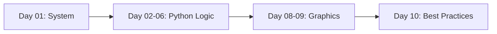

<!-- markdownlint-disable MD033 -->

  
   
  
  
  

<!-- markdownlint-enable MD033 -->

# Seminar: Preparation & Fundamentals

The foundation of the technical journey: transitioning from a user to a power user. This seminar covers the essential tools and logical frameworks required for high-level software engineering.

---

> [!IMPORTANT]
> **Core Objectives**: 
> - **Linux Mastery**: Navigation, permissions, and terminal efficiency.
> - **Python Logic**: From variables to complex recursion and modularity.
> - **Graphic Logic**: First steps into 2D rendering with Turtle and Pygame.
> - **Professional Workflow**: Git versioning and Vim/VSCode orchestrations.

## Technical Core

| Layer | Implementation |
|---|---|
| **OS** |   |
| **Logic** |  |
| **Graphics** |   |
| **Tools** |   |

### Daily Learning Sequence

---

## 📅 Chronological Journey

- **Day 01**: Linux fundamentals, distribution architecture, and security basics (Bandit).
- **Day 02**: Arithmetic logic: divisions, modulo, suites, and precision (π calculation).
- **Day 03**: String manipulation: slicing, formatting, and text processing.
- **Day 04**: Control flow: conditions, loops, and introductory cryptography.
- **Day 05**: Data structures: lists, comprehensions, and dictionaries.
- **Day 06**: Functional programming: recursion, scope, and exception handling.
- **Day 07**: Project: Hangman console with modular architecture.
- **Day 08**: External packages: introductory graphics with **Turtle** and **Pygame**.
- **Day 09**: Project: Graphical Hangman with back/front integration.
- **Day 10**: Final review, code optimization, and professional best practices.

---

## 🎨 Skills developed

- **Technical Agility**: Seamless navigation in a Unix-like environment.
- **Computational Thinking**: Solving complex problems through recursive and modular logic.
- **Creative Coding**: Visualizing logic through 2D graphics and game loops.
- **Professional Discipline**: Writing clean, PEP8 compliant, and version-controlled code.