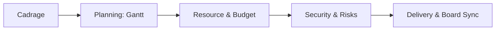

<!-- markdownlint-disable MD033 -->

  
   
  
  
  

<!-- markdownlint-enable MD033 -->

# Seminar: Strategic Project Management (SmartFridge)

Beyond the code: mastering the industrial frameworks of product innovation, risk mitigation, and strategic resource orchestration for the **SmartFridge** ecosystem.

---

> [!IMPORTANT]
> **Core Objectives**: 
> - **Cadrage**: Defining the mission, scope, and strategic alignment.
> - **Planning**: Construction and optimization of complex **Gantt** charts.
> - **Financials**: Managing **CAPEX/OPEX** chiffrage and resource allocation.
> - **Communication**: Orchestrating board-level reporting and stakeholder kits.

## Management Core

| Pillar | Implementation |
|---|---|
| **Timeline** |   |
| **Execution** |   |
| **Quality** |   |
| **Output** |  |

### Project Lifecycle

---

## Key Deliverables (PAR-15)

- **Budget Consolidation**: Detailed CAPEX/OPEX hypothesis and chiffrage.
- **Gantt Orchestration**: Complete project timeline with dependencies and critical paths.
- **Resource Matrix**: Mapping human and material assets to project phases.
- **Risk Mitigation**: Probabilistic impact analysis and strategic fallback plans.
- **Strategic Communication**: Multi-channel kits for team alignment and board reporting.

---

## Skills developed

- **Strategic Vision**: Translating business goals into structured implementation plans.
- **Financial Acumen**: Understanding the economic impact of technical decisions.
- **Risk Governance**: Anticipating bottlenecks and implementing robust mitigation.
- **Leadership Sync**: Mastering the art of professional delivery and stakeholder management.
