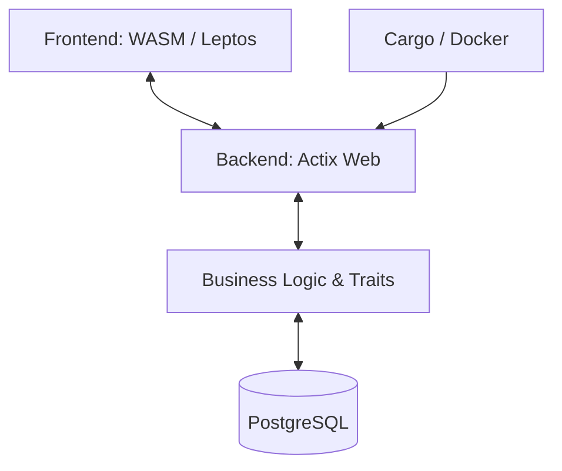

<!-- markdownlint-disable MD033 -->

  
   
  
  
  

<!-- markdownlint-enable MD033 -->

# Seminar: Systems Programming & Modern Web (Rust)

Entering the elite tier of systems engineering: mastering **Ownership**, **Borrowing**, and **Lifetimes** to build zero-cost abstractions with absolute memory safety.

---

> [!IMPORTANT]
> **Core Objectives**: 
> - **Ownership Mastery**: Deep dive into the borrow checker and memory management.
> - **Full-Stack Rust**: Building decoupled architectures with Actix/Rocket and Yew/Leptos.
> - **WASM Compilation**: Bringing high-performance code to the browser.
> - **Database Synergy**: Type-safe database interactions with PostgreSQL.

## Technical Core

| Layer | Implementation |
|---|---|
| **Language** |  |
| **Backend** |   |
| **Frontend** |   |
| **Database** |  |

### Decoupled Rust Architecture

---

## 📅 Chronological Journey

- **Day 71-73**: **Bootstrap**: Ownership fundamentals, borrowing, lifetimes, and pattern matching.
- **Day 74-76**: **Core API**: Building RESTful services with Actix and robust error handling.
- **Day 77-80**: **Project: Hello World**: A complete, containerized full-stack Rust application.

---

## 🎨 Skills developed

- **Memory Fearlessness**: Writing complex systems without fearing Segfaults or Race Conditions.
- **Zero-Cost Abstractions**: Leveraging traits and generics for high-level logic with C-level speed.
- **Type-Safe Full-Stack**: Ensuring data integrity from the DB schema to the UI state.
- **Modern Build Lifecycle**: Mastering Cargo, cross-compilation, and Rust Dockerization.
