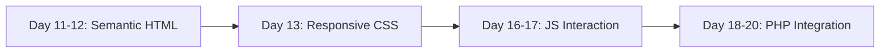

<!-- markdownlint-disable MD033 -->

  
   
  
  
  

<!-- markdownlint-enable MD033 -->

# Seminar: Full-Stack Web Foundations

Transitioning from local scripting to the global web: mastering the protocols, languages, and architectures that power the modern internet.

---

> [!IMPORTANT]
> **Core Objectives**: 
> - **Frontend Precision**: Semantic HTML5, CSS3 layout mastery, and responsive design.
> - **Client-Side Logic**: Modern JavaScript (ES6+), DOM manipulation, and asynchronous communication.
> - **Server-Side Integration**: PHP 8 fundamentals and database connectivity.
> - **UI/UX Frameworks**: Rapid prototyping with Materialize CSS.

## Technical Core

| Layer | Implementation |
|---|---|
| **Structure** |   |
| **Client** |  |
| **Server** |  |
| **Design** |  |

### Development Workflow

---

## Chronological Journey

- **Day 11**: System scripts for web management: archiving, compression, and deployment.
- **Day 12**: Semantic HTML5 architecture and web accessibility standards (CodingPedia).
- **Day 13**: Advanced CSS layout and rapid prototyping with **Materialize**.
- **Day 14-15**: Integrated mini-project: building a cohesive web interface.
- **Day 16**: JavaScript core: types, functions, and algorithmic foundations.
- **Day 17**: DOM Mastery: event-driven programming and dynamic UI updates.
- **Day 18**: PHP fundamentals: syntax, arrays, and server-side logic.
- **Day 19**: Dynamic forms: server-side validation and templating.
- **Day 20**: Full integration: **Fetch API**, JSON, and live client-server communication.

---

## Skills developed

- **Full-Stack Thinking**: Understanding the handover between client and server.
- **Standards Compliance**: Writing clean, semantic, and SEO-friendly code.
- **Asynchronous Flow**: Implementing real-time feedback loops without page reloads.
- **Responsive Architecture**: Designing interfaces that adapt to any device.